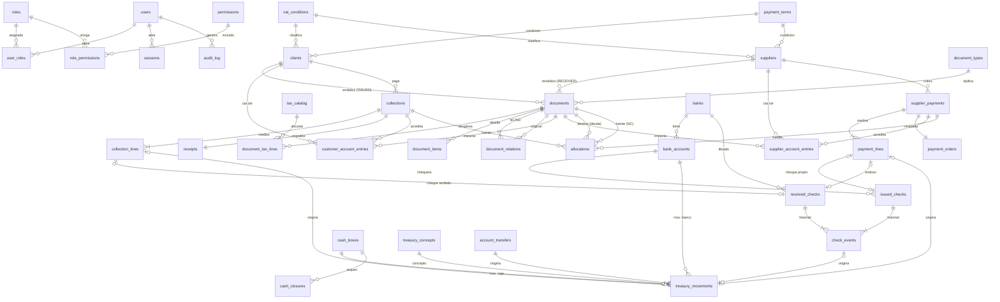

# ERP Administrativo-Financiero PyME — Diseño de la Fase 1

**Estado:** propuesta para aprobación. No se escribió código.
**Fecha:** 05/10/2026
**Alcance:** secciones A a M pedidas en el punto 54 de la especificación.

> Convención de este documento: **[DECISIÓN Dn]** marca un punto donde propongo un criterio por defecto que necesita tu confirmación. Todas están consolidadas en la sección M. Si estás de acuerdo con todas las recomendaciones, alcanza con aprobar el documento.

---

## Índice

- A. Análisis funcional
- B. Arquitectura
- C. Stack y justificación
- D. Modelo de datos
- E. Diagrama de relaciones
- F. Módulos de la Fase 1
- G. Reglas de negocio
- H. Seguridad
- I. Auditoría
- J. Backup y restauración
- K. Estrategia de pruebas
- L. Riesgos
- M. Decisiones pendientes
- Anexo 1. Contradicciones y ambigüedades detectadas en la especificación
- Anexo 2. Estructura de carpetas
- Anexo 3. Plan de etapas y criterio de avance

---

## A. Análisis funcional

### A.1 Qué es el sistema

Un ERP web, multiusuario, para **registrar y controlar** la información administrativa y financiera de **una** PyME argentina. Integra dos circuitos que terminan en tesorería:

```
CLIENTES ─► COMPROBANTES EMITIDOS (registro) ─► CTA. CTE. CLIENTES ─► COBRANZAS ─► IMPUTACIÓN ─► CAJA / BANCOS / CARTERA ─► RECIBO INTERNO
PROVEEDORES ─► COMPROBANTES RECIBIDOS (registro) ─► CTA. CTE. PROVEEDORES ─► PAGOS ─► IMPUTACIÓN ─► CAJA / BANCOS / CHEQUES ─► ORDEN DE PAGO INTERNA
```

El sistema **registra hechos que ya ocurrieron** (un comprobante ya emitido por el sistema de facturación externo, una factura de proveedor ya recibida, un cobro, un pago) y a partir de ellos **deriva** saldos, vencimientos, disponibilidades, reportes y proyecciones.

### A.2 Qué hace

| Área | Funciones |
|---|---|
| Maestros | ABM de clientes y proveedores con baja lógica, validación de CUIT y control de duplicados. Catálogos configurables (condiciones IVA, tipos de comprobante, alícuotas, percepciones, medios de pago, bancos, cuentas, condiciones de pago). |
| Comprobantes emitidos | Registro de Facturas A, B, E, FCE MiPyME, NC y ND ya emitidas, con detalle por alícuota de IVA, conceptos no gravados/exentos, percepciones y otros impuestos. Control de duplicados. |
| Comprobantes recibidos | Registro de Facturas A, B, C, E, FCE MiPyME, NC y ND de proveedores, con el mismo detalle tributario. Control de duplicados por proveedor. |
| Cuentas corrientes | Libro de movimientos por cliente y por proveedor (débito/crédito/saldo), saldos vencidos y a vencer, saldo a favor. |
| Cobranzas | Registro de cobros con uno o varios medios (efectivo, transferencia, cheque de terceros, retenciones sufridas), imputación a uno o varios comprobantes, saldo a favor, recibo interno numerado. |
| Pagos | Registro de pagos con uno o varios medios (efectivo, transferencia, cheque propio, cheque de terceros endosado si se aprueba D7, retenciones practicadas), imputación, orden de pago interna numerada. |
| Imputaciones | Servicio central que aplica créditos (cobranzas, pagos, notas de crédito, saldos a favor) contra débitos (facturas, notas de débito), sin sobreimputar. |
| Tesorería | Caja(s) con saldo inicial, movimientos, arqueo y cierre; cuentas bancarias con movimientos; cartera de cheques recibidos; cheques emitidos con su ciclo de vida; movimientos manuales controlados (gastos bancarios, transferencias entre cuentas propias, otros ingresos/egresos). |
| Reportes | Cuentas corrientes, deuda, vencimientos, antigüedad de saldos, cobranzas, pagos, caja, bancos, cheques, subdiarios de IVA (emitidos/recibidos) por período, flujo de fondos. Exportación a Excel y PDF. |
| Dashboard | Indicadores derivados de los datos reales. |
| Seguridad | Usuarios, roles, permisos, sesiones, auditoría inviolable. |
| Backup | Automático y manual, verificación de integridad, restauración documentada y probada. |

### A.3 Qué NO hace (límites duros)

- No emite facturas, notas de crédito ni notas de débito fiscales.
- No solicita ni genera CAE, no genera QR fiscal, no genera numeración fiscal.
- No se comunica con ARCA ni con ningún web service fiscal.
- No reemplaza al sistema de facturación ni actúa como controlador fiscal.
- No existe ningún servicio, botón o pantalla que aparente emitir un comprobante fiscal. El módulo se llama **Comprobantes Emitidos** (registro), nunca "Facturación".
- Los **recibos** y **órdenes de pago** que genera son documentos **internos** y así lo dicen impresos en el encabezado ("Documento interno – no válido como comprobante fiscal").

### A.4 Fuera de alcance de la Fase 1 (preparado, no desarrollado)

Contabilidad general (asientos, plan de cuentas), stock, compras con órdenes de compra, ventas con pedidos, conciliación bancaria automática con extractos, cálculo automático de retenciones (agente de retención) y emisión de certificados, Libro IVA Digital en formato de importación ARCA, operaciones multimoneda con diferencias de cambio, multiempresa, integración con ARCA. La arquitectura deja puntos de extensión para cada uno (ver B.6).

### A.5 Actores

| Rol | Uso típico |
|---|---|
| Administrador | Configuración, usuarios y permisos, backups, anulaciones sensibles. |
| Administración | Maestros, registro de comprobantes, cuentas corrientes, cobranzas y pagos. |
| Tesorería | Caja, bancos, cheques, cobranzas y pagos. |
| Consulta | Solo lectura y reportes. |

---

## B. Arquitectura

### B.1 Estilo

**Monolito modular** sobre Next.js (App Router), desplegado como una única aplicación web contra una única base PostgreSQL. Para una PyME con decenas de usuarios es la opción con menos piezas móviles, transacciones ACID reales entre módulos (una cobranza toca cuenta corriente, imputaciones, caja/banco, cheques, numeración y auditoría en **una sola transacción**) y un solo despliegue. Los módulos están separados por carpeta y por reglas de dependencia, de modo que mañana se pueda extraer uno sin reescribir.

### B.2 Capas

```
┌──────────────────────────────────────────────────────────────────────────┐
│ UI (React Server Components + Client Components, Tailwind)               │
│  páginas, formularios, tablas, filtros, dashboard. Valida para UX.       │
└──────────────────────────────┬───────────────────────────────────────────┘
                               │ (form submit / fetch)
┌──────────────────────────────▼───────────────────────────────────────────┐
│ ACTIONS / API  (Server Actions y Route Handlers)                         │
│  1. autentica la sesión   2. verifica permiso   3. valida con Zod        │
│  4. llama a UN servicio   5. traduce errores a mensajes de UI            │
│  No contiene reglas de negocio ni SQL.                                   │
└──────────────────────────────┬───────────────────────────────────────────┘
┌──────────────────────────────▼───────────────────────────────────────────┐
│ SERVICIOS DE NEGOCIO  (TypeScript puro, sin dependencias de Next.js)     │
│  reglas financieras y fiscales, cálculos, orquestación transaccional,    │
│  idempotencia, auditoría. Abren la transacción y la pasan hacia abajo.   │
└──────────────────────────────┬───────────────────────────────────────────┘
┌──────────────────────────────▼───────────────────────────────────────────┐
│ REPOSITORIOS (Drizzle)                                                   │
│  consultas, persistencia, bloqueos (SELECT … FOR UPDATE). Reciben `tx`.  │
└──────────────────────────────┬───────────────────────────────────────────┘
┌──────────────────────────────▼───────────────────────────────────────────┐
│ POSTGRESQL                                                               │
│  PK, FK, UNIQUE, CHECK, índices parciales, triggers de inmutabilidad,    │
│  restricciones diferidas de consistencia, permisos por rol de BD.        │
└──────────────────────────────────────────────────────────────────────────┘
```

Reglas de dependencia (verificadas con ESLint `boundaries` en CI):

- La UI nunca importa repositorios ni el cliente de base de datos.
- Las Actions/API solo importan servicios, esquemas Zod y el módulo de autorización.
- Los servicios no importan nada de `next/*`, de modo que se testean con Vitest sin levantar Next.js.
- Todo archivo de servidor lleva `import "server-only"` para que nunca termine en el bundle del navegador.

### B.3 Defensa en profundidad de las reglas financieras

Cada regla crítica se verifica en **tres** lugares, y la base de datos es la última barrera que no puede saltearse:

| Regla | UI | Servicio | Base de datos |
|---|---|---|---|
| Total = componentes | Calcula en vivo | Recalcula y rechaza | `CHECK` en cabecera + trigger diferido que compara cabecera vs. líneas |
| No sobreimputar | Limita el input | Bloquea filas (`FOR UPDATE`) y valida | `CHECK (balance >= 0)` en comprobante y en cobranza/pago |
| No duplicar comprobante | Aviso al tipear | Busca antes de insertar | Índice `UNIQUE` parcial |
| No duplicar operación | Botón deshabilitado | Clave de idempotencia | `UNIQUE (idempotency_key)` |
| No borrar finanzas | Sin botón | Sin método `delete` | Trigger `BEFORE DELETE` que aborta + `REVOKE DELETE` al rol de la app |
| No doble impacto en tesorería | — | Un solo punto de creación de movimientos | `UNIQUE (origin_type, origin_id, origin_line)` en movimientos |

### B.4 Transacciones y concurrencia

- Toda operación con impacto financiero corre en `db.transaction(...)` con aislamiento **READ COMMITTED + bloqueo pesimista explícito** de las filas afectadas (`SELECT … FOR UPDATE`), siempre en orden ascendente de ID para evitar deadlocks. Es más predecible que `SERIALIZABLE` (no requiere reintentos por fallos de serialización) y es suficiente porque toda escritura pasa por los mismos servicios.
- La numeración interna (recibos, órdenes de pago) se toma con `UPDATE numbering_sequences SET next_value = next_value + 1 … RETURNING` **dentro** de la misma transacción: sin huecos si la operación falla y sin colisiones entre usuarios simultáneos.
- **Idempotencia:** cada formulario de operación crítica genera un UUID al renderizarse (campo oculto). El servicio inserta la operación con ese `idempotency_key` único; si llega un reintento (doble clic, F5, reconexión) encuentra la operación ya registrada y devuelve el mismo resultado sin volver a impactar.

### B.5 Flujo de una petición (ejemplo: registrar cobranza)

1. Formulario (Client Component) → Server Action `registerCollection(formData)`.
2. Action: `requireSession()` → `requirePermission("collections.create")` → `CollectionInputSchema.parse()`.
3. Servicio `collectionsService.register(input, ctx)` abre transacción:
   1. verifica idempotencia;
   2. bloquea cliente y comprobantes a imputar;
   3. inserta cobranza + líneas de medios;
   4. por cada medio: movimiento de caja / banco, o alta de cheque en cartera, o registro de retención;
   5. asiento en cuenta corriente del cliente (crédito);
   6. llama a `allocationService.allocate(...)` con la misma `tx`;
   7. toma número de recibo y crea el recibo interno;
   8. escribe auditoría;
   9. commit.
4. Action devuelve `{ ok, collectionId, receiptNumber }` y la UI redirige al recibo.

### B.6 Puntos de extensión para fases futuras (no se desarrollan)

- `documents.origin` (`MANUAL` en Fase 1; reservado `IMPORT`, `ARCA`) y `documents.external_ref` para vincular con un sistema de facturación o con ARCA.
- `currency` y `exchange_rate` en comprobantes, cobranzas, pagos y cuentas, con restricción que en Fase 1 limita el comportamiento (ver D5).
- Tabla de catálogo de impuestos genérica (permite sumar jurisdicciones, regímenes o retenciones calculadas sin migrar el modelo).
- Eventos de dominio registrados en auditoría, reutilizables como fuente para una futura contabilidad.

---

## C. Stack y justificación

| Componente | Elección | Justificación |
|---|---|---|
| Framework | **Next.js 15+ (App Router)** | Obligatorio. Un solo proyecto para UI y backend; Server Components reducen el JavaScript en el cliente y permiten leer datos sin exponer APIs; Server Actions dan mutaciones tipadas con protección de origen incorporada. |
| Lenguaje | **TypeScript `strict`** (+ `noUncheckedIndexedAccess`) | Obligatorio. Tipos compartidos entre esquema de BD, validación y UI. |
| Estilos | **Tailwind CSS** | Obligatorio. Consistencia visual sin hojas de estilo divergentes. Se suma una capa mínima de componentes propios (botón, input, tabla, modal) con Radix UI primitives para accesibilidad de diálogos y menús. |
| Base de datos | **PostgreSQL 16 o 17** | ACID, `NUMERIC` exacto, `CHECK`, índices parciales (clave para duplicados que excluyen anulados), restricciones diferidas, triggers, roles y permisos por tabla, `pg_dump`/`pg_restore` maduros y gratuitos. Sin costo de licencia. |
| ORM | **Drizzle ORM + drizzle-kit** | Ver C.1. |
| Validación | **Zod** | Un mismo esquema valida en el formulario (react-hook-form) y en el servidor. |
| Dinero | **NUMERIC(18,2)** en BD, **decimal.js** en TypeScript | Nunca `float`. Drizzle devuelve `numeric` como `string`; se convierte a `Decimal` en el borde del repositorio y se opera siempre con `Decimal`. Redondeo: half-up a 2 decimales en un único helper `money.ts`. |
| Autenticación | **Sesiones propias en BD + Argon2id** (`@node-rs/argon2`) | Ver C.2. |
| Fechas | **date-fns + @date-fns/tz** | Zona `America/Argentina/Buenos_Aires`; formato `dd/MM/yyyy`. |
| Formato regional | `Intl.NumberFormat("es-AR", { style: "currency", currency: "ARS" })` | `$ 1.234.567,89`. |
| Tablas | **TanStack Table** | Ordenamiento, filtros y paginación del lado servidor para listados grandes. |
| Formularios | **react-hook-form** + resolver Zod | Formularios largos (comprobante con N alícuotas) sin re-render excesivo. |
| PDF | **@react-pdf/renderer** (servidor) | Recibos, órdenes de pago y reportes en PDF sin depender de un navegador headless en el servidor. |
| Excel | **ExcelJS** | Exportación con tipos numéricos reales (no texto), formatos y totales. |
| Gráficos | **Recharts** | Evolución de cuentas por cobrar/pagar en el dashboard. |
| Importe en letras | Módulo propio `numberToSpanishWords` | Es pequeño y crítico; se escribe con tests exhaustivos en vez de depender de una librería poco mantenida. |
| Logs | **pino** | Logs estructurados sin datos sensibles. |
| Pruebas | **Vitest**, **Testcontainers (PostgreSQL)**, **Playwright**, **fast-check** | Ver sección K. |
| Despliegue | **Docker Compose** (app + PostgreSQL + servicio de backup) detrás de un proxy HTTPS (Caddy) | Reproducible en un servidor local o en un VPS (ver D1). |

### C.1 ¿Por qué Drizzle y no Prisma?

Las dos son válidas. Elijo **Drizzle** por estas razones concretas para este ERP:

1. **Restricciones en el esquema:** Drizzle declara `CHECK`, índices `UNIQUE` **parciales** (`WHERE status <> 'ANULADO'`) e índices compuestos en el propio esquema TypeScript. En Prisma los CHECK y los índices parciales hay que agregarlos a mano en SQL y el ORM no los conoce, lo que facilita que una migración posterior los pierda.
2. **Control del SQL y de los bloqueos:** `SELECT … FOR UPDATE`, `UPDATE … RETURNING` y transacciones con nivel de aislamiento explícito se expresan directamente. Son el corazón de la imputación y la numeración.
3. **Migraciones SQL legibles:** drizzle-kit genera archivos `.sql` que se revisan y versionan; triggers y permisos se agregan en migraciones SQL propias en el mismo flujo.
4. **Liviano:** sin motor binario adicional, consultas tipadas cercanas a SQL, buen rendimiento en reportes con agregaciones.

Costo aceptado: Drizzle es más "cerca del SQL", lo que exige disciplina en los repositorios. Si preferís Prisma por familiaridad del equipo, el diseño no cambia; solo se mueven las restricciones a migraciones SQL manuales (**[DECISIÓN D12]**).

### C.2 ¿Por qué sesiones propias y no un servicio externo?

- El sistema es interno, con usuario y contraseña, sin login social. Una sesión en tabla `sessions` (token aleatorio de 256 bits, guardado **hasheado** con SHA-256, cookie `HttpOnly; Secure; SameSite=Lax`) permite **revocar** sesiones al instante (baja de usuario, cambio de rol o contraseña), algo que los JWT sin estado no permiten.
- Argon2id es el algoritmo recomendado por OWASP para contraseñas.
- Son ~300 líneas de código propio, auditables, sin dependencia de un proveedor. Alternativa equivalente: **Better Auth** con adaptador Drizzle; la dejo como opción si preferís una librería mantenida por terceros.

---

## D. Modelo de datos

### D.1 Convenciones generales

| Convención | Regla |
|---|---|
| Claves primarias | `id BIGINT GENERATED ALWAYS AS IDENTITY`. No se exponen en URLs sensibles sin control de permisos. |
| Importes | `NUMERIC(18,2)`. Alícuotas `NUMERIC(6,3)` (ej. 10,500). Cotizaciones `NUMERIC(18,6)`. Nunca `REAL`/`DOUBLE`. |
| Fechas de negocio | `DATE` (fecha del comprobante, vencimiento, fecha de cobro). No tienen hora ni zona. |
| Instantes | `TIMESTAMPTZ` (creación, auditoría, sesiones). Se muestran en `America/Argentina/Buenos_Aires`. |
| Estados | `TEXT` con `CHECK (status IN (...))`. Más fácil de migrar que los `ENUM` nativos de PostgreSQL. |
| Trazabilidad de fila | `created_at`, `created_by`, `updated_at`, `updated_by` en todas las tablas de negocio; `version INT` para bloqueo optimista en ediciones de maestros y comprobantes. |
| Borrado | Ninguna tabla financiera admite `DELETE`: trigger `BEFORE DELETE` que lanza error y `REVOKE DELETE` al rol de la aplicación. Maestros: baja lógica (`status`, `deactivated_at`, `deactivated_by`, `deactivation_reason`). |
| Corrección | Anulación (marca + motivo + usuario + fecha) y/o **reversión** (fila espejo con `reversal_of_id` que apunta a la original, `UNIQUE` para que solo pueda revertirse una vez). |
| Snapshots | Los comprobantes, recibos y órdenes de pago guardan copia de razón social, CUIT y condición IVA del tercero **al momento del registro**, para que un cambio posterior del maestro no altere documentos históricos. |
| Convención de débito/crédito en cuentas corrientes | Como pide la especificación, en **ambas** cuentas corrientes *Débito = aumenta la deuda* (del cliente con la empresa, o de la empresa con el proveedor) y *Crédito = la disminuye*. Es convención de gestión, no contable. |

Nombres de tablas y columnas en inglés (como la lista de la sección 40); toda la interfaz, mensajes y reportes en español.

### D.2 Seguridad y configuración

**users**
| Columna | Tipo | Restricciones |
|---|---|---|
| id | bigint | PK |
| username | text | NOT NULL, UNIQUE (sobre `lower(username)`) |
| full_name | text | NOT NULL |
| email | text | UNIQUE (`lower(email)`) |
| password_hash | text | NOT NULL (Argon2id, formato PHC) |
| status | text | CHECK IN ('ACTIVE','BLOCKED','INACTIVE') |
| failed_login_count | int | NOT NULL DEFAULT 0 |
| locked_until | timestamptz | |
| must_change_password | bool | DEFAULT true |
| password_changed_at, last_login_at | timestamptz | |

**roles** (`id`, `code` UNIQUE, `name`, `is_system` bool) — semilla: ADMIN, ADMINISTRACION, TESORERIA, CONSULTA.
**permissions** (`id`, `code` UNIQUE, `module`, `description`) — códigos tipo `documents.create`, `documents.annul`, `collections.create`, `collections.annul`, `treasury.manual_movement`, `cash.close`, `users.manage`, `backup.run`, `audit.read`, etc.
**role_permissions** (`role_id` FK, `permission_id` FK) — PK compuesta.
**user_roles** (`user_id` FK, `role_id` FK) — PK compuesta. Un usuario puede tener más de un rol (en una PyME es común que la misma persona haga administración y tesorería). Los permisos efectivos son la unión.
**sessions** (`id`, `token_hash` UNIQUE, `user_id` FK, `created_at`, `last_seen_at`, `expires_at`, `ip`, `user_agent`, `revoked_at`, `revoke_reason`). Índice por `user_id`.

**company** — fila única (`CHECK (id = 1)`): razón social, nombre de fantasía, CUIT, condición IVA (FK), domicilio fiscal, localidad, provincia (FK), código postal, Nº IIBB, inicio de actividades, logo (ruta), datos para encabezados de recibos.
**configuration** (`key` PK, `value` jsonb, `description`, `updated_at`, `updated_by`) — parámetros: tolerancia de redondeo de IVA, días de alerta de vencimiento, fecha de bloqueo de período, duración de sesión, política de contraseñas, retención de backups, permitir CUIT duplicado, formato de numeración, etc. Todo cambio se audita.

**Catálogos configurables** (todos con `id`, `code` UNIQUE, `name`, `active`, orden de visualización):
- **vat_conditions**: Responsable Inscripto, Monotributista, Consumidor Final, Exento, No Responsable, Sujeto No Categorizado, Proveedor/Cliente del Exterior, IVA Liberado, Monotributista Social, Pequeño Contribuyente Eventual (se cargan con el código ARCA de referencia; se pueden activar/desactivar).
- **id_types**: CUIT, CUIL, CDI, DNI, Pasaporte, CUIT país (exterior), Sin identificar.
- **provinces**: 24 jurisdicciones con código ARCA y código de jurisdicción IIBB (Convenio Multilateral).
- **payment_terms**: Contado, 30 días, 30/60, etc. (`days` int CHECK ≥ 0).
- **document_types**: ver D.4.
- **tax_catalog**: ver D.4.
- **treasury_concepts**: conceptos de movimientos manuales (gastos bancarios, intereses, impuesto a los débitos y créditos, aportes, retiros, transferencia entre cuentas propias, otros), con `direction` IN/OUT/BOTH y `allows_manual` bool.
- **banks**: entidades bancarias (`bcra_code` UNIQUE, nombre).
- **expense_categories** (opcional): rubros para clasificar comprobantes recibidos en reportes.

### D.3 Terceros

**clients**
| Columna | Tipo | Restricciones |
|---|---|---|
| id | bigint | PK |
| code | text | UNIQUE (código interno, autonumerado) |
| legal_name | text | NOT NULL |
| id_type_id | FK id_types | NOT NULL |
| tax_id | text | 11 dígitos si es CUIT/CUIL (CHECK `~ '^[0-9]{11}$'`), validado con dígito verificador en servicio |
| vat_condition_id | FK vat_conditions | NOT NULL |
| address, city, postal_code | text | |
| province_id | FK provinces | |
| phone, email, contact_name | text | email con CHECK de formato básico |
| payment_term_id | FK payment_terms | |
| credit_days | int | CHECK ≥ 0 |
| credit_limit | numeric(18,2) | CHECK ≥ 0, NULL = sin límite |
| status | text | CHECK IN ('ACTIVE','INACTIVE') |
| duplicate_tax_id_reason | text | ver regla de duplicados |
| notes | text | |
| deactivated_at / _by / _reason | | |

Índices y unicidad:
- `UNIQUE (tax_id) WHERE tax_id IS NOT NULL AND duplicate_tax_id_reason IS NULL` → solo puede haber **un** registro "normal" por CUIT; un segundo registro con el mismo CUIT exige cargar el motivo (ej. sucursal con cuenta corriente separada) y solo es posible si el parámetro `allow_duplicate_tax_id` está habilitado y el usuario tiene permiso `clients.duplicate_tax_id`. Queda auditado.
- `CHECK` de coherencia: si el tipo de identificación es CUIT, `tax_id` es obligatorio. Consumidor Final puede no tener CUIT (DNI o "sin identificar"). Cliente del exterior (Factura E) usa CUIT país o identificador fiscal extranjero.
- Índices de búsqueda: `lower(legal_name)` con `pg_trgm` para búsqueda parcial, `tax_id`.

**suppliers**: mismos campos que `clients` más `activity` (rubro), `bank_id` FK banks, `cbu` (CHECK `~ '^[0-9]{22}$'` + validación de dígitos verificadores en servicio), `cbu_alias`, `credit_limit` (informativo: crédito que el proveedor nos otorga). Misma regla de unicidad de CUIT.

No se permite dar de baja un tercero con saldo distinto de cero o con cheques en circulación; la baja no borra nada, solo impide nuevas operaciones.

### D.4 Comprobantes registrados (tabla común `documents`)

**Decisión de diseño:** una única tabla `documents` para emitidos y recibidos, diferenciados por `direction`. Justificación: los dos circuitos comparten el 90% de la estructura (tipo, punto de venta, número, fechas, componentes tributarios, saldo, estado), el mismo servicio de imputación y los mismos reportes de IVA. Las diferencias (tercero, regla de duplicado, tipos permitidos) se resuelven con `CHECK` e índices parciales por `direction`. Duplicar la tabla duplicaría también servicios, triggers y reportes.

**document_types**
| Columna | Descripción |
|---|---|
| id, arca_code (UNIQUE, nullable para internos) | 1 Factura A, 2 ND A, 3 NC A, 6 Factura B, 7 ND B, 8 NC B, 11 Factura C, 12 ND C, 13 NC C, 19 Factura E, 20 ND E, 21 NC E, 201/202/203 FCE A, 206/207/208 FCE B, 211/212/213 FCE C |
| name, letter (A/B/C/E/–) | |
| class | CHECK IN ('INVOICE','DEBIT_NOTE','CREDIT_NOTE','INTERNAL_DEBIT','OPENING_DEBIT','OPENING_CREDIT') |
| is_fce | bool |
| is_fiscal | bool (false para internos: saldo inicial, débito por cheque rechazado) |
| allowed_issued, allowed_received | bool — qué tipos se ofrecen en cada módulo |
| balance_side | derivado de `class`: DEBIT (factura, ND, débito interno, saldo inicial deudor) o CREDIT (NC, saldo inicial acreedor) |
| vat_creditable | bool — false para B y C recibidas (IVA no discriminado, no computa crédito fiscal) |

**tax_catalog**
| Columna | Descripción |
|---|---|
| id, code UNIQUE, name | ej. `IVA_21`, `IVA_10_5`, `PERC_IVA`, `PERC_IIBB_CABA`, `PERC_IIBB_BA`, `RET_GANANCIAS`, `IMP_INTERNOS` |
| kind | CHECK IN ('VAT','PERCEPTION','RETENTION','OTHER_TAX') |
| rate | numeric(6,3), obligatorio para VAT (0; 2,5; 5; 10,5; 21; 27) |
| jurisdiction_id | FK provinces (IIBB) |
| valid_from, valid_to | vigencia; el servicio solo ofrece las vigentes a la fecha del comprobante |

**documents**
| Columna | Tipo | Restricciones / notas |
|---|---|---|
| id | bigint | PK |
| direction | text | CHECK IN ('ISSUED','RECEIVED') |
| document_type_id | FK | tipo permitido para la dirección (validado por trigger) |
| point_of_sale | int | CHECK 0–99999 (0 solo para tipos internos) |
| number | bigint | CHECK 1–99999999 |
| client_id | FK clients | |
| supplier_id | FK suppliers | CHECK: ISSUED ⇒ client_id NOT NULL y supplier_id NULL; RECEIVED ⇒ al revés |
| party_name, party_tax_id, party_vat_condition_id | snapshot | |
| issue_date | date | NOT NULL |
| due_date | date | NOT NULL, CHECK `due_date >= issue_date` |
| vat_period | date | primer día del mes del período de IVA (para recibidos puede diferir de la fecha del comprobante) |
| concept | text | CHECK IN ('PRODUCTS','SERVICES','BOTH') |
| description | text | |
| currency | char(3) | DEFAULT 'ARS' |
| exchange_rate | numeric(18,6) | DEFAULT 1, CHECK > 0; CHECK `currency <> 'ARS' OR exchange_rate = 1` |
| net_taxed | numeric(18,2) | Σ bases de las líneas de IVA |
| net_untaxed | numeric(18,2) | no gravado |
| net_exempt | numeric(18,2) | exento |
| vat_total | numeric(18,2) | Σ IVA por alícuota |
| perceptions_total | numeric(18,2) | Σ percepciones |
| other_taxes_total | numeric(18,2) | Σ otros impuestos |
| discount_total | numeric(18,2) | descuentos/deducciones (ver Anexo 1, punto 9) |
| total | numeric(18,2) | CHECK `total > 0` y CHECK `total = net_taxed + net_untaxed + net_exempt + vat_total + perceptions_total + other_taxes_total - discount_total` |
| balance | numeric(18,2) | saldo pendiente (débitos) o crédito disponible (NC). CHECK `balance >= 0 AND balance <= total` |
| status | text | CHECK IN ('OPEN','PARTIAL','SETTLED','ANNULLED') |
| annulled_at / _by / annul_reason | | obligatorios si ANNULLED (CHECK) |
| reason | text | motivo de NC/ND (obligatorio para esas clases, CHECK vía trigger) |
| origin | text | 'MANUAL' (Fase 1); reservado 'IMPORT' |
| external_ref | text | referencia opcional al sistema de facturación externo |
| idempotency_key | uuid | UNIQUE |
| version, created_*, updated_* | | |

Todos los componentes con CHECK ≥ 0.

Unicidad (control de duplicados, sección 5, 17 y 18):
```sql
-- Emitidos: la empresa tiene un solo CUIT, el contexto es la propia empresa
CREATE UNIQUE INDEX ux_documents_issued
  ON documents (document_type_id, point_of_sale, number)
  WHERE direction = 'ISSUED' AND status <> 'ANNULLED';

-- Recibidos: el contexto es el proveedor
CREATE UNIQUE INDEX ux_documents_received
  ON documents (supplier_id, document_type_id, point_of_sale, number)
  WHERE direction = 'RECEIVED' AND status <> 'ANNULLED';
```
Se excluyen los anulados para que un comprobante **mal cargado** pueda anularse (queda en el historial) y volver a registrarse correctamente con el mismo número (**[DECISIÓN D3]**). Adicionalmente, para recibidos se alerta (sin bloquear) si existe el mismo tipo/PV/número para **otro** proveedor con el mismo CUIT.

Índices: `(client_id, issue_date)`, `(supplier_id, issue_date)`, `(direction, due_date) WHERE balance > 0 AND status <> 'ANNULLED'` (vencimientos y antigüedad), `(direction, vat_period)` (subdiarios de IVA).

**document_tax_lines** (la `document_taxes` de la sección 40)
| Columna | Restricciones |
|---|---|
| id, document_id FK | |
| tax_id FK tax_catalog | |
| kind | copia de `tax_catalog.kind`, CHECK IN ('VAT','PERCEPTION','OTHER_TAX') |
| base_amount | obligatorio si kind = VAT (CHECK), ≥ 0 |
| rate | snapshot de la alícuota vigente |
| amount | CHECK ≥ 0 |
| jurisdiction_id | FK provinces, obligatorio para percepciones de IIBB |
| | UNIQUE (document_id, tax_id, jurisdiction_id) |

Así IVA, percepciones y otros impuestos nunca se mezclan: cada línea tiene su tipo, y la cabecera tiene un total por tipo.

**document_items** (opcional): líneas descriptivas para clasificar el comprobante (`description`, `expense_category_id`, `amount`). No intervienen en el cálculo del total; si se cargan, un trigger diferido exige que su suma sea igual a `net_taxed + net_untaxed + net_exempt`. Permite, por ejemplo, separar en un comprobante recibido "servicios de flete" y "insumos".

**document_relations**
| Columna | Restricciones |
|---|---|
| id | PK |
| document_id | FK documents (la NC, ND o débito interno) |
| related_document_id | FK documents (el comprobante original) |
| relation_type | CHECK IN ('CREDIT_NOTE_OF','DEBIT_NOTE_OF','REJECTED_CHECK_DEBIT') |
| | CHECK `document_id <> related_document_id`; UNIQUE (document_id, related_document_id); trigger: ambos con la misma `direction` y el mismo tercero |

**Restricción diferida de consistencia** (`CONSTRAINT TRIGGER … DEFERRABLE INITIALLY DEFERRED`): al momento del COMMIT verifica, para cada comprobante tocado, que `net_taxed = Σ base VAT`, `vat_total = Σ amount VAT`, `perceptions_total = Σ amount PERCEPTION`, `other_taxes_total = Σ amount OTHER_TAX`. Si algo no coincide, la transacción entera se revierte.

### D.5 Cuentas corrientes

**customer_account_entries** y **supplier_account_entries** (las `customer_accounts`/`supplier_accounts` de la sección 40). Son libros **append-only**: el saldo no se guarda, se calcula.

| Columna | Restricciones |
|---|---|
| id | PK |
| client_id / supplier_id | FK NOT NULL |
| entry_date | date |
| entry_type | CHECK IN ('DOCUMENT','COLLECTION' / 'PAYMENT','REVERSAL') |
| document_id | FK documents, nullable |
| collection_id / payment_id | FK, nullable |
| debit, credit | numeric(18,2), CHECK ≥ 0 y CHECK exactamente uno > 0 |
| description | text |
| reversal_of_id | FK a la misma tabla, UNIQUE |
| | UNIQUE (document_id, entry_type) y UNIQUE (collection_id, entry_type): un mismo comprobante o cobranza no puede impactar dos veces |

El saldo progresivo se obtiene con `SUM(debit - credit) OVER (PARTITION BY client_id ORDER BY entry_date, id)`. Índice `(client_id, entry_date, id)`.

### D.6 Cobranzas, pagos e imputaciones

**collections**
| Columna | Restricciones |
|---|---|
| id | PK |
| client_id | FK NOT NULL |
| collection_date | date |
| total_amount | CHECK > 0 |
| unapplied_amount | CHECK `>= 0 AND <= total_amount` (saldo a favor disponible) |
| status | CHECK IN ('ACTIVE','ANNULLED') |
| receipt_id | FK receipts |
| notes, idempotency_key UNIQUE, annulled_*, created_* | |

**collection_lines** (medios de cobro de una cobranza; una cobranza puede combinar varios)
| Columna | Restricciones |
|---|---|
| id, collection_id FK, line_no | UNIQUE (collection_id, line_no) |
| method | CHECK IN ('CASH','TRANSFER','CHECK','RETENTION') |
| amount | CHECK > 0 |
| cash_box_id | obligatorio si CASH |
| bank_account_id, transfer_date, transfer_reference | obligatorios si TRANSFER |
| received_check_id | obligatorio si CHECK (FK received_checks, UNIQUE) |
| retention_tax_id, retention_certificate_number, retention_date | obligatorios si RETENTION |

Un `CHECK` por método garantiza que solo estén completos los campos de ese medio. Trigger diferido: `Σ amount de líneas = collections.total_amount`.

**supplier_payments** y **payment_lines**: espejo de las anteriores. Métodos: `CASH`, `TRANSFER`, `OWN_CHECK` (FK issued_checks, UNIQUE), `THIRD_PARTY_CHECK` (endoso de un cheque en cartera, FK received_checks; sujeto a D7), `RETENTION` (retención practicada al proveedor, registrada manualmente con su certificado).

**allocations** (servicio central de imputaciones; reemplaza a `collection_allocations` y `payment_allocations`, que se exponen como **vistas** con esos nombres)
| Columna | Restricciones |
|---|---|
| id | PK |
| ledger | CHECK IN ('AR','AP') |
| target_document_id | FK documents — comprobante deudor (factura, ND, débito interno, saldo inicial deudor) |
| source_kind | CHECK IN ('COLLECTION','PAYMENT','CREDIT_DOCUMENT') |
| source_collection_id / source_payment_id / source_document_id | exactamente uno no nulo y coherente con `source_kind` y `ledger` (CHECK) |
| amount | CHECK > 0 |
| allocation_date | date |
| status | CHECK IN ('ACTIVE','REVERSED') |
| reversed_at / _by / reversal_reason | obligatorios si REVERSED |
| created_* | |

Justificación de la tabla única: una nota de crédito también se imputa contra una factura (sección 21: "nota de crédito → reducción del débito"), igual que una cobranza. Con una sola tabla y un solo servicio, la regla "no sobreimputar" se implementa y se prueba **una vez**.

Invariantes (garantizados por servicio + CHECK sobre saldos cacheados):
- `documents.balance (deudor) = total − Σ allocations ACTIVE donde target = documento`
- `documents.balance (NC) = total − Σ allocations ACTIVE donde source_document = NC`
- `collections.unapplied_amount = total_amount − Σ allocations ACTIVE de esa cobranza`

`balance` y `unapplied_amount` son **cachés** de esas sumas, actualizados en la misma transacción que la imputación. Los `CHECK (>= 0)` hacen físicamente imposible una sobreimputación aunque hubiera un error de código. Una tarea de verificación (y la suite de pruebas) recalcula las sumas y compara.

### D.7 Recibos, órdenes de pago y numeración

**receipts**: `id`, `number` (UNIQUE), `collection_id` (FK UNIQUE), `issue_date`, snapshot del cliente (nombre, CUIT), `amount`, `amount_in_words`, `status` ('ACTIVE','ANNULLED'), `annulled_*`, `created_*`. El detalle de medios e imputaciones se lee de la cobranza; los textos del tercero son snapshot para que una reimpresión sea idéntica al original.
**payment_orders**: espejo para pagos; incluye además el detalle de retenciones practicadas.
**numbering_sequences**: `key` PK (`RECEIPT`, `PAYMENT_ORDER`, `CLIENT_CODE`, `SUPPLIER_CODE`, `INTERNAL_DOC`), `prefix`, `next_value` (CHECK > 0), `padding`. Formato por defecto: `R-00000001`, `OP-00000001` (**[DECISIÓN D9]**).

### D.8 Tesorería

**cash_boxes**: `id`, `name` UNIQUE, `currency`, `active`.
**bank_accounts**: `id`, `bank_id` FK, `account_type` (CC/CA), `account_number`, `cbu` UNIQUE, `alias`, `currency`, `display_name`, `active`.

**treasury_movements** (libro único de tesorería; `cash_movements` y `bank_movements` son **vistas** filtradas)
| Columna | Restricciones |
|---|---|
| id | PK |
| account_kind | CHECK IN ('CASH','BANK') |
| cash_box_id / bank_account_id | exactamente uno según `account_kind` (CHECK) |
| movement_date | date |
| value_date | date (fecha valor bancaria, opcional) |
| direction | CHECK IN ('IN','OUT') |
| amount | CHECK > 0 |
| concept_id | FK treasury_concepts |
| description, reference | text |
| origin_type | CHECK IN ('OPENING','COLLECTION_LINE','PAYMENT_LINE','CHECK_EVENT','ACCOUNT_TRANSFER','MANUAL','CASH_COUNT_DIFF','REVERSAL') |
| origin_id | bigint (ID de la línea de cobranza, línea de pago, evento de cheque, transferencia, etc.) |
| reversal_of_id | FK a la misma tabla, UNIQUE |
| idempotency_key | uuid UNIQUE (movimientos manuales) |
| created_* | |
| | `UNIQUE (origin_type, origin_id, direction) WHERE origin_type NOT IN ('MANUAL')` → **una línea de cobranza o de pago no puede generar dos movimientos** |
| | `UNIQUE (cash_box_id) WHERE origin_type='OPENING'` (ídem bancos): un único saldo inicial por cuenta |

Justificación del libro único: la caja y los bancos tienen la misma mecánica (ingreso/egreso con origen). Un único libro con un único punto de escritura (`treasuryService.record`) es lo que permite garantizar "no doble impacto" con una sola restricción. Las vistas `cash_movements` y `bank_movements` cumplen con la lista de la sección 40.

**account_transfers**: transferencias entre cuentas propias (depósito de efectivo en banco, extracción, transferencia entre bancos). Genera dos movimientos (OUT en origen, IN en destino) con `origin_type='ACCOUNT_TRANSFER'`. CHECK origen ≠ destino, misma moneda.

**cash_closures**: `id`, `cash_box_id`, `closure_date`, `system_balance` (calculado), `counted_amount` (arqueo), `count_detail` jsonb (billetes y monedas, opcional), `difference` (CHECK = counted − system), `difference_movement_id` FK, `closed_by`, `notes`. UNIQUE (cash_box_id, closure_date). Una vez cerrada una fecha, no se aceptan movimientos de esa caja con fecha ≤ cierre.

**received_checks**
| Columna | Restricciones |
|---|---|
| id | PK |
| format | CHECK IN ('PHYSICAL','ECHEQ') |
| check_type | CHECK IN ('COMMON','DEFERRED') |
| issuer_bank_id | FK banks |
| number | text NOT NULL |
| drawer_tax_id, drawer_name | librador (puede ser distinto del cliente: cheque de terceros) |
| client_id | FK clients (de quién lo recibimos) |
| issue_date, payment_date | CHECK `payment_date >= issue_date` |
| amount | CHECK > 0 |
| status | CHECK IN ('IN_PORTFOLIO','DEPOSITED','CREDITED','REJECTED','ENDORSED','ANNULLED') |
| deposit_bank_account_id, deposited_at, credited_at | |
| rejected_at, rejection_reason | |
| endorsed_payment_line_id | si se endosó (D7) |
| version | bloqueo optimista |
| | UNIQUE (issuer_bank_id, number, drawer_tax_id) WHERE status <> 'ANNULLED' |

**issued_checks**
| Columna | Restricciones |
|---|---|
| id, bank_account_id FK, format, check_type, number | UNIQUE (bank_account_id, number) — un número de chequera nunca se reutiliza, ni anulado |
| amount | CHECK > 0 |
| issue_date, payment_date | CHECK `payment_date >= issue_date` |
| supplier_id | FK suppliers |
| status | CHECK IN ('ISSUED','DELIVERED','PRESENTED','DEBITED','REJECTED','ANNULLED') |
| debited_at, debit_movement_id | FK treasury_movements |
| notes, version | |

**check_events**: historial **append-only** de cada cambio de estado de cualquier cheque (`check_kind` RECEIVED/ISSUED, FK al cheque, `from_status`, `to_status`, `event_date`, `treasury_movement_id` si generó movimiento, `notes`, `created_by`, `created_at`). Las transiciones válidas se validan en el servicio y con un trigger (máquina de estados, ver G.11).

### D.9 Proyección, auditoría y backups

**planned_cash_items**: ingresos y egresos proyectados que no surgen de comprobantes (sueldos, cargas sociales, alquiler, impuestos). `direction`, `concept_id`, `expected_date`, `amount`, `description`, `status` ('PLANNED','REALIZED','CANCELLED'), `recurrence` opcional (mensual). **No** impactan en saldos reales; solo en el flujo de fondos proyectado.

**audit_log**: ver sección I.

**backup_runs**: `id`, `kind` ('AUTO','MANUAL','PRE_RESTORE'), `started_at`, `finished_at`, `file_name`, `size_bytes`, `sha256`, `app_version`, `schema_version` (última migración aplicada), `pg_version`, `control_totals` jsonb (ver J), `status`, `verified_at`, `verify_status`, `created_by`.

**schema_migrations**: la gestiona drizzle-kit; su último registro identifica la versión del esquema.

### D.10 Cardinalidades principales

| Relación | Cardinalidad |
|---|---|
| client → documents (ISSUED) | 1 : N |
| supplier → documents (RECEIVED) | 1 : N |
| document → document_tax_lines | 1 : N (al menos una línea si hay neto gravado) |
| document → document_items | 1 : 0..N |
| document (NC/ND) → document (original) vía document_relations | N : M (una NC puede referir a varias facturas) |
| client → customer_account_entries | 1 : N |
| collection → collection_lines | 1 : 1..N |
| collection_line (CHECK) → received_check | 1 : 1 |
| collection → receipt | 1 : 1 |
| collection / payment / NC → allocations → document deudor | N : M resuelta por `allocations` |
| collection_line / payment_line → treasury_movement | 1 : 0..1 (0 para cheques y retenciones) |
| received_check / issued_check → check_events | 1 : 1..N |
| check_event → treasury_movement | 1 : 0..1 (solo acreditación, débito o rechazo de algo ya acreditado) |
| user ↔ role ↔ permission | N : M : N |
| bank → bank_accounts | 1 : N |
| bank_account / cash_box → treasury_movements | 1 : N |

---

## E. Diagrama de relaciones

Diagrama en formato Mermaid (se visualiza en GitHub, VS Code y la mayoría de los visores Markdown). Se omiten columnas de auditoría.



Vista simplificada de los dos circuitos:

```
 clients ──< documents(ISSUED) ──< allocations >── collections ──< collection_lines ──┬─ CASH ───────► treasury_movements (caja)
                │                        ▲               │                            ├─ TRANSFER ───► treasury_movements (banco)
                ▼                        │               ▼                            ├─ CHECK ──────► received_checks ─► check_events ─► treasury_movements
     customer_account_entries     NC (documents)      receipts                        └─ RETENTION ──► (sin movimiento de fondos)

 suppliers ─< documents(RECEIVED) ─< allocations >── supplier_payments ─< payment_lines ──┬─ CASH ─────────► treasury_movements (caja)
                │                                           │                             ├─ TRANSFER ─────► treasury_movements (banco)
                ▼                                           ▼                             ├─ OWN_CHECK ────► issued_checks ─► check_events ─► treasury_movements (al debitarse)
     supplier_account_entries                        payment_orders                       ├─ THIRD_PARTY ──► received_checks (ENDORSED)
                                                                                          └─ RETENTION ────► (sin movimiento de fondos)
```

---

## F. Módulos de la Fase 1

Cada módulo vive en `src/modules/<módulo>/` con sus propias acciones, servicio, repositorio, esquemas y componentes (ver Anexo 2). Los permisos indicados son los del rol por defecto; el administrador puede ajustar la matriz.

| # | Módulo | Pantallas principales | Operaciones | Roles con escritura |
|---|---|---|---|---|
| 1 | **Autenticación y usuarios** | Login, cambio de contraseña, ABM de usuarios, roles y matriz de permisos, sesiones activas | Alta/baja/bloqueo de usuarios, asignar roles, revocar sesiones | Administrador |
| 2 | **Configuración** | Empresa, parámetros, catálogos (condiciones IVA, tipos de comprobante, impuestos y alícuotas, condiciones de pago, conceptos de tesorería, bancos, cuentas bancarias, cajas, numeraciones), bloqueo de período | ABM de catálogos con vigencias | Administrador |
| 3 | **Clientes** | Listado con búsqueda y filtros, ficha, alta/edición, historial de cambios | Alta, modificación, baja lógica, reactivación | Administración |
| 4 | **Proveedores** | Ídem clientes, con datos bancarios | Ídem | Administración |
| 5 | **Comprobantes emitidos** | Listado (filtros por fecha, tipo, cliente, estado, vencido), formulario de registro con grilla de alícuotas, detalle con imputaciones y relaciones | Registrar, editar (con restricciones), vincular NC/ND, anular registro | Administración |
| 6 | **Comprobantes recibidos** | Ídem para proveedores, con percepciones e impuestos | Ídem | Administración |
| 7 | **Cuentas corrientes** | Cuenta corriente por cliente / proveedor (débito, crédito, saldo progresivo), resumen (saldo, vencido, a vencer, facturado, cobrado, saldo a favor, última operación, último pago), composición de saldo por comprobante | Consulta, exportación, imputación de NC/saldos a favor desde la ficha | Administración |
| 8 | **Cobranzas** | Registro en un solo formulario: cliente → comprobantes pendientes → medios (efectivo/transferencia/cheque/retención) → imputación → confirmación → recibo | Registrar, imputar/desimputar, anular | Administración, Tesorería |
| 9 | **Pagos** | Ídem para proveedores → orden de pago | Registrar, imputar/desimputar, anular | Administración, Tesorería |
| 10 | **Imputaciones** | Panel de comprobantes abiertos vs. créditos disponibles (cobranzas/pagos con saldo, NC), propuesta automática por vencimiento | Imputar, desimputar | Administración |
| 11 | **Caja** | Libro de caja con saldo progresivo, arqueo, cierre diario, historial de cierres | Saldo inicial, movimientos manuales permitidos, arqueo, cierre | Tesorería |
| 12 | **Bancos** | Cuentas, libro por cuenta, saldo contable y saldo disponible, transferencias entre cuentas propias | Saldo inicial, movimientos manuales permitidos (gastos, intereses, impuestos bancarios), transferencias internas | Tesorería |
| 13 | **Cheques** | Cartera de recibidos (por fecha de cobro), emitidos pendientes de débito, historial por cheque | Depositar, acreditar, rechazar, cobrar por ventanilla, registrar entrega/presentación/débito de propios, anular propios no entregados | Tesorería |
| 14 | **Recibos y órdenes de pago** | Visualización, impresión y PDF; reimpresión con marca "COPIA"/"ANULADO" | Generación automática al registrar la operación | (automático) |
| 15 | **Tesorería** | Vista consolidada: caja + bancos + cartera + cheques emitidos pendientes; ingresos/egresos por concepto y período; movimientos proyectados manuales | Alta de ingresos/egresos proyectados | Tesorería |
| 16 | **Reportes** | Ver sección G.15 | Exportar Excel/PDF | Todos (lectura) |
| 17 | **Dashboard** | Indicadores de la sección 33 con enlace al detalle que los origina | — | Todos (lectura, según permisos) |
| 18 | **Flujo de fondos** | Semanal / mensual, real vs. proyectado | — | Todos (lectura) |
| 19 | **Auditoría** | Consulta filtrable del registro de auditoría, comparación antes/después, verificación de integridad de la cadena | — | Administrador (lectura) |
| 20 | **Backup** | Historial de backups, backup manual, verificación, descarga | Ejecutar backup, verificar | Administrador |
| 21 | **Verificación de consistencia** | Ejecuta los invariantes financieros (G.14) y muestra PASS/FAIL por invariante | — | Administrador |

Rol **Consulta**: lectura de todos los módulos operativos y reportes; sin acceso a usuarios, configuración, auditoría ni backup.

---

## G. Reglas de negocio

### G.1 Registración de comprobantes (emitidos y recibidos)

1. **Tipos permitidos** por módulo según `document_types.allowed_issued/allowed_received`. Emitidos: A, B, E, FCE MiPyME, NC y ND de esas letras. Recibidos: A, B, C, E, FCE MiPyME, NC y ND.
2. **Numeración ingresada por el usuario**: punto de venta (1–99999) y número (1–99999999). El sistema nunca la propone, modifica ni completa. Se muestra con el formato `00001-00000123`.
3. **Duplicados**: se verifican al salir del campo número (aviso inmediato) y al guardar (servicio + índice único). Clave: emitidos `tipo + PV + número`; recibidos `proveedor + tipo + PV + número`. Los comprobantes anulados no cuentan (D3).
4. **Coherencia letra / condición IVA del tercero**: se valida contra una **matriz configurable** (por ejemplo, Factura A a un Responsable Inscripto o Monotributista; Factura B a Consumidor Final o Exento). Por defecto la incoherencia produce una **advertencia** que el usuario debe confirmar, no un bloqueo, porque el comprobante ya fue emitido por el sistema externo y el ERP debe poder registrar la realidad. La matriz no se hardcodea (sección 13). La empresa decide si alguna combinación debe bloquear (D11).
5. **Vencimiento**: por defecto `fecha + días de plazo del tercero`; editable. Debe ser ≥ fecha del comprobante.
6. **Período de IVA**: por defecto el mes de la fecha del comprobante; en recibidos se puede imputar a un período posterior (registro tardío). No se acepta registrar ni anular en un período bloqueado (`configuration.locked_until_date`).
7. **Snapshot** del tercero (nombre, CUIT, condición IVA) al registrar.
8. **Moneda**: en Fase 1 todos los saldos y la tesorería operan en ARS. Los comprobantes en moneda extranjera (típicamente Factura E) registran moneda, cotización e importe original, y los componentes en ARS al tipo de cambio del comprobante (D5).
9. **Edición**:
   - Sin imputaciones activas: se pueden corregir todos los datos; queda auditado con antes/después y se re-ejecutan todas las validaciones.
   - Con imputaciones activas: solo campos no financieros (observaciones, concepto, vencimiento con motivo). Para corregir importes, tercero, tipo o número hay que desimputar y luego editar o anular.
10. **Anulación del registro** (no confundir con una anulación fiscal, que en Argentina se hace con una NC): requiere permiso `documents.annul`, motivo obligatorio y que no tenga imputaciones activas. Efectos: `status = ANNULLED`, `balance = 0`, asiento de reversión en la cuenta corriente, auditoría. Nada se borra.
11. **Límite de crédito**: al registrar un comprobante emitido que hace superar el límite del cliente se muestra una advertencia, nunca un bloqueo (el comprobante ya existe). El límite se usa en reportes y en el dashboard.
12. **Estados**: se almacenan `OPEN`, `PARTIAL`, `SETTLED`, `ANNULLED`, que se actualizan en la misma transacción que modifica el saldo. **Vencido no se almacena**: se deriva (`due_date < hoy AND balance > 0`), porque cambia con el paso del tiempo sin que ocurra ninguna operación. En pantalla y reportes se muestran exactamente los estados pedidos:

| Almacenado | balance | Emitidos (pantalla) | Recibidos (pantalla) |
|---|---|---|---|
| OPEN | = total | Pendiente (o **Vencido** si venció) | Pendiente (o **Vencido**) |
| PARTIAL | 0 < balance < total | Parcialmente cobrado (o **Vencido**) | Parcialmente pagado (o **Vencido**) |
| SETTLED | 0 | Cobrado | Pagado |
| ANNULLED | 0 | Anulado | Anulado |

### G.2 IVA y estructura tributaria

1. Cada comprobante tiene **N líneas de IVA**, una por alícuota (0; 2,5; 5; 10,5; 21; 27), cada una con su base imponible y su importe. Más líneas de **percepciones** (IVA, IIBB por jurisdicción, Ganancias, otras) y de **otros impuestos** (internos, etc.). Nunca un campo genérico "iva".
2. El usuario ingresa bases e importes tal como figuran en el comprobante. El backend:
   - recalcula `IVA esperado = redondeo(base × alícuota)` por línea y acepta diferencias dentro de una **tolerancia configurable** por línea (los sistemas de facturación redondean ítem por ítem y pueden diferir en centavos). Fuera de tolerancia: rechazo con mensaje claro (D4);
   - calcula `net_taxed`, `vat_total`, `perceptions_total`, `other_taxes_total`;
   - calcula `total = netos + IVA + percepciones + otros impuestos − descuentos`.
3. **El usuario no escribe el total**. Opcionalmente puede tipear el "total según comprobante" como control: si no coincide con el calculado, no se puede guardar. Así es imposible registrar un total incompatible con sus componentes. La base de datos lo vuelve a verificar con `CHECK` y con la restricción diferida (D.4).
4. **Comprobantes que no discriminan IVA** (Factura B o C recibida por la empresa): no se cargan líneas de IVA; el importe se registra como "importe con IVA no discriminado" (columna `net_untaxed`, con `document_types.vat_creditable = false`) y no suma crédito fiscal en el subdiario. Para **Factura B emitida**, la empresa sí debe registrar el débito fiscal: se cargan neto e IVA por alícuota según el sistema de facturación (Anexo 1, punto 8).
5. **Factura E** (exportación): sin IVA; el importe va a `net_exempt` o `net_untaxed` según configuración del tipo.
6. **Retenciones**: no forman parte del comprobante (en Argentina se practican o sufren al momento del pago/cobro). Se registran como **medio** de la cobranza (retención sufrida) o del pago (retención practicada), con su certificado. En Fase 1 se **registran**, no se calculan (D8).
7. Toda la lógica fiscal está centralizada en `src/modules/tax/` (catálogo, vigencias, matriz de letras, cálculo y tolerancias). Ninguna alícuota está escrita en el código: vienen de `tax_catalog` con vigencia `valid_from/valid_to`.

### G.3 Notas de crédito y notas de débito

**Nota de crédito**
1. Se registra como comprobante (emitido o recibido) de clase `CREDIT_NOTE`, con su propio detalle de IVA, percepciones y motivo obligatorio.
2. Se vincula a uno o más comprobantes originales del **mismo tercero y la misma dirección** (`document_relations`). El vínculo es obligatorio salvo que se marque explícitamente "NC sin comprobante asociado" (bonificaciones globales) con motivo.
3. Impacto en cuenta corriente: **crédito** por su total.
4. Impacto en saldos de comprobantes: la NC queda como **crédito disponible** (`balance = total`). Si el comprobante original tiene saldo, el sistema propone imputarla automáticamente contra él (el usuario confirma); la imputación es una fila en `allocations` con `source_kind = CREDIT_DOCUMENT`. Si el original ya estaba cancelado, la NC queda como saldo a favor del tercero.
5. Impacto en IVA: en los subdiarios y reportes suma con **signo negativo** en neto, IVA y percepciones del período en que se registra.
6. No genera ningún movimiento de tesorería ni ninguna "cobranza ficticia".

**Nota de débito**
1. Comprobante de clase `DEBIT_NOTE`, con detalle tributario y motivo.
2. Vinculada al original cuando corresponde (intereses, diferencias de precio).
3. Cuenta corriente: **débito**. Saldo propio (`balance = total`) que se cancela con cobranzas/pagos/NC como cualquier factura.
4. IVA: suma con signo positivo.

### G.4 Cuentas corrientes

Cada evento genera exactamente un asiento, en la misma transacción que el evento:

| Evento | Clientes | Proveedores |
|---|---|---|
| Factura / ND / débito interno registrado | Débito | Débito |
| NC registrada | Crédito | Crédito |
| Cobranza / pago registrado (por el total, esté o no imputado) | Crédito | Crédito |
| Anulación de cualquiera de los anteriores | Asiento de reversión (signo opuesto, `reversal_of_id`) | Ídem |
| Imputación / desimputación | **Sin asiento** (cambia la composición del saldo, no el saldo) | Ídem |
| Saldo inicial de puesta en marcha | Débito o crédito | Débito o crédito |

- **Saldo de la cuenta corriente** = Σ débitos − Σ créditos. Un saldo negativo significa **saldo a favor** del tercero.
- **Composición del saldo** = Σ saldos de comprobantes deudores − Σ créditos sin aplicar (cobranzas/pagos con `unapplied_amount > 0` y NC con `balance > 0`). Ambas cifras deben ser **iguales** siempre (invariante G.14-1).
- **Vencido / a vencer**: sobre los comprobantes deudores con saldo, según `due_date` vs. fecha de corte.
- **Total facturado / comprado**: Σ facturas + ND − NC del período (no anulados).
- **Total cobrado / pagado**: Σ cobranzas / pagos activos del período.
- **Saldo a favor**: Σ créditos sin aplicar.
- **Última operación / último pago**: máxima fecha de asiento / de cobranza o pago activo.

Nota sobre la sección 21 ("cobranza imputada → crédito"): propongo que la cobranza acredite la cuenta corriente **al registrarse**, aunque no esté imputada. Si solo acreditara al imputarse, una cobranza sin imputar no aparecería en la cuenta del cliente y el "saldo a favor" no podría calcularse. La imputación decide **qué** comprobantes quedan cancelados. Ver Anexo 1, punto 1.

### G.5 Cobranzas

1. Una cobranza tiene un cliente, una fecha y **uno o más medios**; `total = Σ medios`.
2. **Efectivo** → movimiento IN en la caja elegida.
3. **Transferencia** → movimiento IN en la cuenta bancaria elegida, con fecha y referencia. Aviso si ya existe un movimiento bancario con la misma cuenta, fecha, importe y referencia (posible doble carga).
4. **Cheque** → alta en `received_checks` con estado `IN_PORTFOLIO`. **No** genera movimiento bancario (sección 24). Aumenta la cartera.
5. **Retención sufrida** → registra impuesto, número de certificado y fecha. Cancela deuda sin mover fondos. Alimenta el reporte de retenciones sufridas.
6. Asiento de crédito en la cuenta corriente por el total.
7. Imputación (opcional en el mismo paso): ver G.7. Lo no imputado queda como saldo a favor (`unapplied_amount`), imputable después.
8. Número de recibo interno tomado de la secuencia **dentro** de la transacción.
9. Idempotencia por `idempotency_key`.
10. **Anulación** (permiso `collections.annul`, motivo obligatorio). Precondiciones: los cheques recibidos en esa cobranza siguen en cartera; la fecha no está en un período bloqueado ni en una caja cerrada. Efectos, todos en una transacción: reversión de las imputaciones, reversión de los movimientos de caja/banco, cheques a `ANNULLED` (con evento), asiento de reversión en cuenta corriente, recibo `ANNULLED` (el número se conserva; se reimprime con la leyenda "ANULADO"). Si un cheque ya fue depositado, la vía correcta es su rechazo (G.10), no la anulación de la cobranza.

### G.6 Pagos a proveedores

1. Igual estructura que la cobranza: proveedor, fecha, uno o más medios, `total = Σ medios`.
2. **Efectivo** → movimiento OUT en caja (bloqueado si deja la caja en negativo a esa fecha; parametrizable).
3. **Transferencia** → movimiento OUT en la cuenta bancaria.
4. **Cheque propio** (físico o ECHEQ) → alta en `issued_checks` con estado `DELIVERED`. **No** genera débito bancario hasta que el cheque se debite (sección 26). Reduce el saldo **disponible** del banco, no el contable.
5. **Cheque de terceros (endoso)** → el cheque pasa de `IN_PORTFOLIO` a `ENDORSED`; sale de cartera; no hay movimiento de fondos (D7).
6. **Retención practicada** → se registra impuesto, certificado e importe. Cancela deuda con el proveedor. En Fase 1 no se calcula ni se genera el certificado; el reporte de retenciones practicadas muestra lo que la empresa debe depositar.
7. Asiento de crédito en la cuenta corriente del proveedor; imputación; orden de pago interna numerada; idempotencia.
8. **Anulación**: precondiciones simétricas (cheques propios no presentados/debitados, cheques endosados todavía no rechazados, período abierto). Efectos simétricos.
9. Lo pagado de más o sin imputar queda como **anticipo / saldo a favor** ante el proveedor.

### G.7 Imputaciones (servicio central)

Entrada: un crédito (cobranza, pago o NC) y una lista de `{comprobante, importe}`.

Validaciones (todas en el servicio, dentro de la transacción, con las filas bloqueadas):
1. Crédito y comprobantes del **mismo tercero**, del mismo circuito (AR o AP) y de la misma moneda.
2. Ningún elemento anulado.
3. Comprobante destino de clase deudora (factura, ND, débito interno, saldo inicial deudor).
4. Cada importe > 0.
5. **Importe imputado a cada comprobante ≤ saldo pendiente** del comprobante.
6. **Σ importes ≤ crédito disponible** de la cobranza/pago/NC.
7. Los `CHECK (balance >= 0)` y `CHECK (unapplied_amount >= 0)` son la red de seguridad final.

Algoritmo de bloqueo: `SELECT … FOR UPDATE` del crédito y de los comprobantes destino ordenados por `id`; recién entonces se leen los saldos, se valida y se escribe. Dos usuarios que imputan al mismo comprobante a la vez quedan serializados: el segundo ve el saldo ya reducido y, si excede, recibe el rechazo.

**Propuesta automática**: el sistema puede sugerir la distribución por fecha de vencimiento más antigua (FIFO). Es solo una sugerencia que el usuario revisa y confirma.

Ejemplo de la especificación: C1 $500.000, C2 $300.000, cobranza $700.000 → C1 $500.000 (saldo 0, SETTLED), C2 $200.000 (saldo $100.000, PARTIAL), crédito disponible $0. Intentar imputar $1 más a cualquiera de los dos se rechaza.

**Desimputación**: marca la imputación `REVERSED` (motivo, usuario, fecha), restituye saldos y estados. No cambia la cuenta corriente ni la tesorería. Permiso `allocations.reverse`.

### G.8 Caja

1. Una o más cajas (D13). Cada una con **un** saldo inicial (`origin_type = OPENING`).
2. **Saldo = Σ IN − Σ OUT**. No existe un campo saldo editable.
3. Ingresos y egresos automáticos desde cobranzas, pagos y transferencias internas (por ejemplo, depósito de efectivo en banco = OUT de caja + IN de banco).
4. **Movimientos manuales**: solo con conceptos marcados `allows_manual` (gastos menores sin comprobante, aportes, retiros). No se puede asociar un cliente o proveedor: lo que tiene contraparte se registra por el circuito que corresponde (cobranza, pago o comprobante recibido). Esto es lo que impide "duplicar manualmente una operación existente".
5. **Arqueo y cierre**: se ingresa el efectivo contado; el sistema calcula la diferencia con el saldo del sistema. Si hay diferencia, se registra un movimiento `CASH_COUNT_DIFF` (sobrante o faltante) con motivo y permiso `cash.close`. Una vez cerrada una fecha, no se aceptan movimientos con fecha ≤ cierre en esa caja.
6. No se permite que un egreso deje la caja en negativo (parámetro, activo por defecto).

### G.9 Bancos

1. Múltiples bancos y cuentas, cada una con moneda. En Fase 1 cada movimiento es en la moneda de la cuenta y no hay operaciones entre monedas (D5).
2. **Saldo contable** = Σ movimientos (IN − OUT).
3. **Saldo disponible** = saldo contable − cheques propios en `ISSUED`, `DELIVERED` o `PRESENTED` de esa cuenta.
4. Movimientos automáticos: transferencias de cobranzas y pagos, acreditación de cheques depositados, débito de cheques propios, transferencias internas.
5. Movimientos manuales: gastos bancarios, intereses, impuesto a los débitos y créditos, otros conceptos permitidos; con referencia y control de idempotencia.
6. Se admite saldo negativo (descubierto acordado) con advertencia.

### G.10 Cheques recibidos (máquina de estados)

```
                 depositar              acreditar
 IN_PORTFOLIO ───────────────► DEPOSITED ───────────► CREDITED
   │   │   │                       │                     │
   │   │   │ cobrar por ventanilla │ rechazar            │ rechazar (posterior a la acreditación)
   │   │   └──────► CREDITED       ▼                     ▼
   │   │           (IN en caja)  REJECTED              REJECTED
   │   │ endosar (pago)
   │   └──────────► ENDORSED ───── rechazo informado por el proveedor ──► REJECTED
   │ anular cobranza
   └──────────────► ANNULLED
```

| Transición | Efecto financiero |
|---|---|
| Alta (cobranza) | Cliente: crédito en cuenta corriente. Cartera +importe. Banco: sin cambios. |
| IN_PORTFOLIO → DEPOSITED | Cartera −importe. Cheque "depositado" en la cuenta elegida. Banco: **sin cambios** (todavía no acreditado). |
| DEPOSITED → CREDITED | Movimiento **IN** en la cuenta bancaria (`origin_type = CHECK_EVENT`). |
| IN_PORTFOLIO → CREDITED (ventanilla) | Movimiento IN en caja o banco. |
| DEPOSITED → REJECTED | Sin movimiento bancario (nunca se acreditó). Se reconstruye la deuda del cliente. |
| CREDITED → REJECTED | Movimiento **OUT** en el banco por el importe (revierte la acreditación). Se reconstruye la deuda del cliente. |
| ENDORSED → REJECTED | Se reconstruye la deuda del cliente **y** la deuda con el proveedor al que se endosó (débito interno en su cuenta corriente). |

**Reconstrucción de deuda por rechazo** (propuesta por defecto, D6): se genera un comprobante **interno** no fiscal "Débito por cheque rechazado" (clase `INTERNAL_DEBIT`, punto de venta 0, número de la secuencia interna) por el importe del cheque, con vencimiento inmediato, vinculado al cheque y a la cobranza original. La cobranza original, sus imputaciones y el recibo **no se tocan** (fueron ciertos en su momento). Los gastos de rechazo que cobra el banco se registran como movimiento bancario manual; si la empresa le factura al cliente una ND por esos gastos, se registra como comprobante emitido normal.

Cada transición genera un `check_events` y, cuando corresponde, un único `treasury_movement` (garantizado por la restricción de unicidad por origen). Una transición inválida (por ejemplo, depositar un cheque endosado) se rechaza en el servicio y en un trigger.

### G.11 Cheques emitidos (máquina de estados)

```
 ISSUED ──entregar──► DELIVERED ──presentar──► PRESENTED ──debitar──► DEBITED
   │                     │   └───────────debitar──────────────────────▲
   │ anular              │ rechazar / anular por anulación del pago
   ▼                     ▼
 ANNULLED            REJECTED / ANNULLED
```

| Estado | Banco contable | Banco disponible | Deuda con proveedor |
|---|---|---|---|
| ISSUED (confeccionado, no entregado) | sin cambio | −importe | sin cambio |
| DELIVERED (entregado en un pago) | sin cambio | −importe | cancelada por el pago |
| PRESENTED | sin cambio | −importe | — |
| DEBITED | **−importe** (único movimiento OUT, `origin_type = CHECK_EVENT`) | — | — |
| REJECTED (sin fondos) | sin cambio (nunca se debitó) | se libera | se reconstruye con un débito interno en la cuenta del proveedor |
| ANNULLED | sin cambio | se libera | si venía de un pago, solo vía anulación del pago |

Así el dinero sale del banco **una sola vez**, al debitarse, y la disponibilidad bancaria distingue emitido / presentado / debitado (sección 26). El número de cheque es único por cuenta y nunca se reutiliza.

### G.12 Tesorería

1. Es la vista consolidada de caja(s), bancos, cartera de cheques y cheques emitidos pendientes.
2. Todo movimiento tiene `origin_type` + `origin_id` que permiten navegar hasta la cobranza, pago, cheque, transferencia o movimiento manual que lo originó. Desde una cobranza se navega a sus movimientos y viceversa.
3. Los movimientos originados en otros módulos solo los crea `treasuryService.record()`; no existe pantalla para crearlos a mano.
4. Ningún movimiento se edita ni se borra. La corrección es una **reversión** (movimiento espejo con `reversal_of_id`), normalmente disparada por la anulación del origen.
5. **Ingresos**: cobranzas, cheques acreditados, otros ingresos manuales. **Egresos**: pagos, cheques debitados, gastos y otros egresos manuales. Los gastos con comprobante fiscal se registran como comprobante recibido y se pagan por el circuito de pagos.

### G.13 Recibos internos y órdenes de pago internas

- Generados automáticamente al confirmar la cobranza/pago; número único por secuencia transaccional.
- Contenido según secciones 28 y 29, con importe en letras ("Son pesos un millón doscientos mil con 50/100").
- Encabezado con los datos de la empresa y la leyenda **"Documento interno – no válido como comprobante fiscal"**.
- Visualización en pantalla, impresión (hoja A4 con estilos de impresión) y PDF.
- Reimpresión: el contenido se arma con el snapshot guardado, así una reimpresión es idéntica. Si la operación fue anulada, la reimpresión lleva la marca "ANULADO".

### G.14 Invariantes financieros (verificación de consistencia)

Se ejecutan en las pruebas automáticas y desde la pantalla de Verificación de consistencia. Cada uno debe dar diferencia **$0,00**:

1. Para cada tercero: saldo de cuenta corriente = Σ saldos de comprobantes deudores − Σ créditos sin aplicar.
2. Para cada comprobante: `balance` = total − Σ imputaciones activas (y estado coherente con el saldo).
3. Para cada cobranza/pago: `unapplied_amount` = total − Σ imputaciones activas; total = Σ medios.
4. Para cada línea de cobranza/pago en efectivo o transferencia: existe exactamente un movimiento de tesorería activo (o uno revertido si la operación está anulada).
5. Cartera de cheques = Σ cheques recibidos en `IN_PORTFOLIO`; y cada cheque `CREDITED` tiene exactamente un movimiento IN no revertido.
6. Cada cheque propio `DEBITED` tiene exactamente un movimiento OUT; ningún otro estado tiene movimiento.
7. Para cada caja/cuenta: saldo = Σ movimientos; saldo de cierre de caja = saldo del sistema a esa fecha + diferencia registrada.
8. Totales de reportes = totales de los módulos de origen (los reportes leen las mismas vistas).
9. Cadena de hashes de auditoría íntegra.

### G.15 Reportes, antigüedad y flujo de fondos

**Reportes** (todos con filtros por período y tercero, exportables a Excel con números reales y a PDF):
- Clientes: comprobantes registrados, cobranzas, deuda, vencimientos, antigüedad, cuenta corriente, retenciones sufridas.
- Proveedores: comprobantes recibidos, pagos, deuda, vencimientos, antigüedad, cuenta corriente, retenciones practicadas.
- Tesorería: libro de caja, libro de banco, cartera de cheques, cheques emitidos, ingresos y egresos por concepto, flujo de fondos.
- Comprobantes: por período, tipo, tercero; **subdiario de IVA ventas y compras** con neto por alícuota, IVA por alícuota, no gravado, exento, percepciones por tipo y jurisdicción, otros impuestos, total; NC con signo negativo.

**Antigüedad de saldos**: tramos 0–30, 31–60, 61–90, 91–180, >180 días, separados en **vencido** (días desde el vencimiento) y **a vencer** (días hasta el vencimiento), y separados por cuentas por cobrar / por pagar. Fecha de corte elegible (por defecto hoy). Los créditos sin aplicar se muestran en una columna aparte, de modo que el total del reporte coincide con el saldo de cuenta corriente.

**Flujo de fondos**:
- **Saldo real inicial** = caja + bancos (saldo contable) a la fecha de inicio.
- **Ingresos proyectados** = saldos de comprobantes emitidos por fecha de vencimiento + cheques en cartera por fecha de cobro + ingresos manuales planificados.
- **Egresos proyectados** = saldos de comprobantes recibidos por vencimiento + cheques propios pendientes de débito por fecha de pago + egresos planificados.
- Vencidos impagos: columna "atrasado" al inicio del período (no se esconden ni se asumen cobrados hoy).
- **Saldo final proyectado** por semana o mes, acumulado.
- Visualmente separados: **real** (lo que ya ocurrió, en tono sólido) y **proyectado** (en tono atenuado y rotulado).

**Dashboard**: cada indicador de la sección 33 se calcula con las mismas consultas de los reportes y enlaza a su detalle.

### G.16 Puesta en marcha (saldos iniciales)

Para empezar a usar el sistema con una empresa en funcionamiento hace falta cargar (D10):
- saldos iniciales de caja y bancos (un movimiento `OPENING` por cuenta);
- cheques en cartera y cheques propios pendientes de débito;
- comprobantes pendientes de clientes y proveedores **uno por uno** (recomendado, permite imputar y ver antigüedad real), o un saldo inicial global por tercero (comprobante interno `OPENING_DEBIT`/`OPENING_CREDIT`).
- Se propone un importador desde planilla Excel con validación previa y reporte de errores, ejecutado una sola vez y auditado.

---

## H. Seguridad

### H.1 Autenticación
- Usuario + contraseña. Hash **Argon2id** (parámetros OWASP: 19 MiB de memoria, 2 iteraciones, paralelismo 1, ajustables por configuración). Nunca se guarda ni se loguea la contraseña.
- Política: mínimo 12 caracteres, rechazo de contraseñas comunes, cambio obligatorio en el primer ingreso y tras un blanqueo hecho por el administrador.
- Bloqueo temporal tras 5 intentos fallidos (15 minutos, parametrizable) y límite de intentos por IP. Mensaje de error genérico ("usuario o contraseña incorrectos").
- **Sesiones en base de datos**: token aleatorio de 256 bits; en la BD se guarda solo su hash SHA-256. Cookie `__Host-session` con `HttpOnly`, `Secure`, `SameSite=Lax`, `Path=/`.
- Expiración por inactividad (30 min) y absoluta (12 h), parametrizables. Token nuevo en cada inicio de sesión (evita fijación de sesión).
- Revocación inmediata de todas las sesiones del usuario al cambiar contraseña, roles o estado. Pantalla de sesiones activas para el administrador.
- Segundo factor (TOTP) opcional, recomendado para el rol Administrador (D15).

### H.2 Autorización
- RBAC: usuario → roles → permisos (`modulo.accion`). Los permisos efectivos se cargan con la sesión.
- **Toda** Server Action y todo Route Handler empieza con `requirePermission("...")`. Los servicios reciben un `ctx` con el usuario y vuelven a verificar el permiso en las operaciones críticas (defensa en profundidad para cuando un servicio se reutilice desde otro punto de entrada).
- El `middleware.ts` de Next.js solo redirige al login a quien no tiene sesión; **nunca** es la única barrera de autorización (lección de la vulnerabilidad CVE-2025-29927, que permitía saltear el middleware).
- La UI oculta lo que el usuario no puede hacer, pero eso es comodidad, no seguridad. Una prueba automática llama a cada acción directamente con cada rol y verifica el rechazo (K.1).
- Los intentos denegados se registran en auditoría con resultado `DENIED`.

### H.3 Protección de datos y de la aplicación
- **Inyección SQL**: todas las consultas son parametrizadas (Drizzle); no se concatena SQL con entradas de usuario. Ordenamientos y filtros dinámicos se resuelven contra listas blancas de columnas.
- **Validación de entradas**: Zod en el servidor para toda entrada; importes como texto decimal canónico convertido a `Decimal`; límites de longitud en todos los textos.
- **XSS**: React escapa por defecto; no se usa `dangerouslySetInnerHTML`; Content-Security-Policy con nonce.
- **CSRF**: las Server Actions verifican que el `Origin` coincida con el host (`serverActions.allowedOrigins` configurado). Los Route Handlers que modifican datos verifican `Origin` y usan cookie `SameSite`.
- **Cabeceras**: HSTS, `X-Frame-Options: DENY`, `X-Content-Type-Options: nosniff`, `Referrer-Policy: same-origin`.
- **HTTPS obligatorio** mediante proxy (Caddy con certificado automático, o certificado interno si es red local).
- **Roles de base de datos de mínimo privilegio**:
  - `erp_owner`: dueño del esquema, solo lo usan las migraciones.
  - `erp_app`: el que usa la aplicación; `SELECT/INSERT/UPDATE` en tablas de negocio, **sin `DELETE`** en tablas financieras, solo `INSERT/SELECT` en `audit_log`, sin `TRUNCATE` ni DDL.
  - `erp_backup`: solo lectura, para `pg_dump`.
- **Secretos**: solo en variables de entorno (archivo `.env` fuera del repositorio, o secretos de Docker). `.env.example` documenta las variables sin valores. Al arrancar, `env.ts` valida con Zod que todas existan; si falta alguna, la app no inicia.
- **Datos personales**: CUIT, domicilios, CBU y contactos son datos personales (Ley 25.326). Se limita su exposición por rol, no se incluyen en logs y los backups se cifran.
- **Dependencias**: lockfile versionado, `npm audit` y actualización periódica (Dependabot/Renovate cuando haya repositorio).
- **Logs** estructurados (pino) sin contraseñas, tokens ni datos completos de cuentas.

---

## I. Auditoría

### I.1 Qué se audita

| Categoría | Eventos |
|---|---|
| Seguridad | Login exitoso y fallido, logout, bloqueo, cambio y blanqueo de contraseña, alta/baja/modificación de usuarios, cambios de roles y permisos, revocación de sesiones, accesos denegados |
| Maestros | Alta, modificación, baja y reactivación de clientes y proveedores (valores anteriores y nuevos) |
| Comprobantes | Registro, edición, vinculación NC/ND, anulación |
| Financiero | Cobranzas, pagos, imputaciones, desimputaciones, anulaciones, todo movimiento de tesorería, cada cambio de estado de cheques, arqueos y cierres, movimientos manuales |
| Configuración | Cambios de parámetros, catálogos, alícuotas, numeraciones, bloqueo de período |
| Sistema | Backups ejecutados, verificaciones, restauraciones, exportaciones de reportes, ejecución de la verificación de consistencia |

### I.2 Cómo

- `auditService.record(tx, evento)` se llama **dentro de la misma transacción** de la operación: si la operación se revierte, su registro de auditoría también, y nunca hay auditoría de algo que no ocurrió. Los rechazos (validación, permiso, error) se registran en una transacción aparte con `result = DENIED` o `ERROR`.
- Estructura de `audit_log`: `id`, `occurred_at` (timestamptz), `user_id`, `username` (snapshot), `session_id`, `ip`, `user_agent`, `request_id`, `module`, `action`, `entity_type`, `entity_id`, `before` (jsonb), `after` (jsonb), `result` (`SUCCESS`/`DENIED`/`ERROR`), `message`, `prev_hash`, `hash`.
- `before`/`after`: en altas, el registro completo; en modificaciones, solo los campos que cambiaron; en operaciones compuestas (cobranza), un resumen con los IDs generados (movimientos, cheques, imputaciones, recibo).

### I.3 Protección contra modificaciones
1. El rol `erp_app` no tiene `UPDATE`, `DELETE` ni `TRUNCATE` sobre `audit_log`.
2. Trigger `BEFORE UPDATE OR DELETE` que aborta, incluso para el dueño del esquema (salvo un superusuario de la base, que la aplicación no usa).
3. **Cadena de hashes**: `hash = SHA-256(prev_hash || contenido canónico del registro)`. La inserción toma un `pg_advisory_xact_lock` para encadenar en orden (el volumen de una PyME lo permite sin impacto perceptible). La pantalla de auditoría tiene "Verificar integridad", que recorre la cadena y señala el primer eslabón alterado. El último hash se guarda con cada backup, así una alteración posterior es detectable comparando contra el backup.
4. Retención: indefinida (como mínimo 10 años, en línea con la conservación de documentación comercial).

---

## J. Backup y restauración

### J.1 Estrategia

| Aspecto | Propuesta |
|---|---|
| Herramienta | `pg_dump` en formato custom (`-Fc`, comprimido, restaurable selectivamente) con la misma versión mayor del servidor |
| Automático | Diario a las 02:00 (hora Argentina) desde un contenedor `backup` con cron |
| Manual | Botón en el módulo Backup (permiso `backup.run`); además se ejecuta automáticamente antes de cada migración y antes de cada restauración (`PRE_RESTORE`) |
| Identificación | Nombre `erp_AAAAMMDD_HHMMSS_<tipo>_v<versión app>_s<versión esquema>.dump` + registro en `backup_runs` (fecha, tamaño, SHA-256, versión de app, versión de esquema, versión de PostgreSQL) |
| Totales de control | Junto al backup se guarda un JSON con cantidad de filas por tabla y sumas clave (Σ totales de comprobantes, Σ saldos, Σ movimientos por cuenta, cartera, último hash de auditoría) |
| Cifrado | El archivo se cifra (age/GPG) antes de salir del servidor; la clave se guarda fuera del servidor |
| Almacenamiento | 1) disco local del servidor, 2) copia **fuera del servidor**: almacenamiento en la nube compatible S3 o un NAS en otra ubicación (D16). Regla 3-2-1 |
| Retención | 7 diarios, 4 semanales, 12 mensuales (parametrizable) |
| Verificación automática | Semanal: se restaura el último backup en una base temporal `erp_verify`, se recalculan los totales de control y los invariantes de G.14 y se comparan con los guardados. Resultado en `backup_runs.verify_status` y alerta en el dashboard del administrador si falla |
| Mejora opcional | Archivado continuo de WAL para recuperar a un punto en el tiempo, si la empresa no puede perder ni un día de operaciones (D16) |

### J.2 Procedimientos (se entregan como runbook en `docs/runbooks/` y se prueban)

1. **Cómo hacer un backup**: automático por cron, manual desde la pantalla Backup, o por consola `npm run db:backup`.
2. **Dónde se guarda**: `/var/backups/erp` (volumen del servidor) y la copia remota configurada. La pantalla Backup lista ambos.
3. **Cómo verificarlo**: `npm run db:backup:verify -- <archivo>` comprueba el SHA-256, ejecuta `pg_restore --list`, restaura en `erp_verify`, compara totales de control e invariantes y muestra PASS/FAIL.
4. **Cómo restaurarlo**: `npm run db:restore -- <archivo>` (por consola, en el servidor, por un administrador). El script: pone la app en modo mantenimiento → hace un backup `PRE_RESTORE` del estado actual → restaura en una base nueva → verifica → intercambia la base → registra en auditoría → reinicia la app.
5. **Cómo comprobar la restauración**: el script compara los totales de control del backup con los de la base restaurada y ejecuta la verificación de consistencia; además el runbook indica una verificación humana (saldo de 3 clientes, 3 proveedores, caja y un banco contra un reporte impreso previo).

La restauración **no se ofrece como botón en la web**: reemplaza toda la información y debe hacerse con la aplicación detenida. Queda implementada y probada como script.

---

## K. Estrategia de pruebas

### K.1 Niveles

| Nivel | Herramienta | Qué cubre |
|---|---|---|
| Unitarias | Vitest | Funciones puras: dinero y redondeo, validación de CUIT y CBU, cálculo de IVA y total, tolerancias, matriz de letras, importe en letras, máquinas de estado de cheques, planificador de imputaciones, tramos de antigüedad, armado del flujo de fondos |
| Propiedades | fast-check | Para cualquier secuencia aleatoria de comprobantes, cobranzas, imputaciones y anulaciones: ningún saldo negativo, Σ imputaciones ≤ créditos, invariantes de G.14 en $0 |
| Integración | Vitest + Testcontainers (PostgreSQL real, migraciones reales) | Cada servicio con su repositorio y la BD: todas las reglas de la sección G, atomicidad (un fallo a mitad de camino no deja nada registrado) |
| Restricciones de BD | Vitest + SQL directo | Se intenta violar cada `CHECK`, `UNIQUE`, FK y trigger **salteando el servicio**: debe fallar. Demuestra que la última barrera existe |
| Concurrencia | Vitest con operaciones en paralelo | Dos imputaciones simultáneas al mismo comprobante; doble envío con la misma clave de idempotencia; 50 recibos en paralelo → 50 números distintos y consecutivos |
| Permisos | Vitest | Matriz completa *acción × rol*: llamada directa a cada Server Action/Route Handler; los no autorizados reciben rechazo y queda auditoría `DENIED` |
| End-to-end | Playwright | Las pruebas integrales de la sección 47 a través del navegador, incluida la generación del PDF del recibo y de la orden de pago |
| Backup | Script | Backup → modificar datos → restaurar → totales de control idénticos a los del backup |

### K.2 Datos
- **Catálogos base** (`db:seed`): roles, permisos, condiciones IVA, tipos de comprobante, alícuotas, provincias, bancos. Se usan en todos los entornos.
- **Datos de prueba** (`db:seed:demo`): el set de la sección 45 (10 clientes, 10 proveedores, 20 + 20 comprobantes, cobranzas y pagos completos y parciales, efectivo, transferencias, cheques, vencidos, a vencer, NC, ND, saldos a favor). Determinístico. **Bloqueado en producción** por variable de entorno.
- **Escenario global** (sección 47): 3 clientes y 3 proveedores con resultados esperados calculados a mano en un archivo de fixtures; la prueba compara cada módulo contra esos números y ejecuta los invariantes.

### K.3 Matriz de aceptación
- Cada criterio de las secciones 46 y 47 tiene un ID (`CLI-01`, `PRV-01`, `CMP-01`, `CC-01`, `IMP-01`, `CAJ-01`, `BCO-01`, `CHQ-01`, `AUD-01`, `BKP-01`, `INT-CLI`, `INT-PRV`, `INT-GLB`, …) que figura en el nombre de la prueba automatizada que lo verifica.
- La matriz (`tests/acceptance/matriz.md`) se **genera** a partir del reporte de ejecución de las pruebas: ID, módulo, criterio, resultado esperado, resultado obtenido, estado (PASS / FAIL / BLOQUEADO). Nunca se completa a mano, de modo que no puede figurar PASS sin ejecución.
- Ante un FAIL se documenta: problema, causa, archivo/módulo, solución, prueba realizada y nuevo resultado.

### K.4 Criterio de avance
Una etapa (Anexo 3) solo se cierra con lint y typecheck sin errores, todas sus pruebas en PASS, las de etapas anteriores todavía en PASS y los invariantes en $0.

---

## L. Riesgos

| # | Riesgo | Prob. | Impacto | Mitigación |
|---|---|---|---|---|
| 1 | **Errores de carga manual** de comprobantes (número, importes, tercero) | Alta | Alto | Duplicados detectados en vivo, total calculado (no tipeado), "total según comprobante" como control, tolerancia de IVA, edición controlada y anulación trazable |
| 2 | **Cambios normativos** (alícuotas, letras, regímenes de percepción, FCE) | Media | Medio | Catálogos con vigencia, matriz de letras configurable, ninguna regla fiscal en el código |
| 3 | **Doble impacto** por concurrencia o reintentos | Media | Alto | Idempotencia, bloqueo de filas, unicidad por origen, pruebas de concurrencia |
| 4 | **Saldos iniciales mal migrados** | Alta | Alto | Importador con validación previa y conciliación contra el sistema anterior por tercero antes de operar (D10) |
| 5 | **Moneda extranjera** (Factura E, cuentas en USD) | Media | Medio | Fase 1 explícitamente en ARS con datos de moneda informativos (D5); el modelo ya tiene las columnas para crecer |
| 6 | **Diferencias de redondeo** con el sistema de facturación | Media | Bajo | Tolerancia configurable por alícuota; importes ingresados tal cual el comprobante |
| 7 | **Backups que no restauran** | Media | Crítico | Verificación automática semanal con restauración real y totales de control |
| 8 | **Falla del servidor o de internet** | Media | Alto | Según hosting (D1): copia remota y reinstalación documentada con Docker |
| 9 | **Bypass de autorización** | Baja | Crítico | Verificación en cada acción y en servicios, middleware no considerado barrera, pruebas de matriz de permisos |
| 10 | **Desvío de alcance hacia facturación** | Media | Medio | Límites del punto A.3; cualquier pedido nuevo se evalúa como fase futura |
| 11 | **Adopción**: usuarios que siguen con planillas paralelas | Media | Alto | Carga ágil con teclado, búsqueda por CUIT, reportes exportables, capacitación |
| 12 | **Rendimiento** de saldos derivados con años de datos | Baja | Medio | Saldos cacheados verificados, índices parciales, vistas materializadas para reportes pesados si hiciera falta |
| 13 | **Particularidades de ECHEQ y FCE** (endosos múltiples, fraccionamiento, aceptación) | Media | Medio | Fase 1 los registra con marca de formato; los flujos especiales quedan para una fase posterior |
| 14 | **Errores de zona horaria** en fechas de negocio | Media | Medio | `DATE` para fechas de negocio y zona `America/Argentina/Buenos_Aires` fija |
| 15 | **Mantenimiento** a largo plazo | Media | Medio | Arquitectura documentada, pruebas automatizadas, dependencias mínimas, actualizaciones de seguridad de Next.js |

---

## M. Decisiones pendientes

Para cada una propongo un valor por defecto. Si aprobás el diseño sin comentarios, se toman las recomendaciones.

| ID | Decisión | Opciones | Recomendación |
|---|---|---|---|
| **D1** | ¿Dónde va a correr el sistema? | a) Servidor propio en la oficina · b) VPS en la nube | **b) VPS**: accesible desde cualquier PC, sin hardware propio que mantener, con HTTPS y backup remoto. Si la conectividad de la oficina es mala, a) |
| **D2** | ¿Una sola empresa? ¿Condición IVA de la empresa? | Una / varias razones sociales | **Una sola empresa, Responsable Inscripto** (se deduce de que emite A, B y E). Multiempresa queda para otra fase |
| **D3** | Un comprobante con el registro anulado, ¿libera su número para volver a cargarlo bien? | Sí / No | **Sí**: la anulación del registro corrige un error de carga; el anulado queda en el historial |
| **D4** | Tolerancia entre el IVA ingresado y base × alícuota | $0,01 · $0,10 · $1,00 por alícuota | **$0,10 por alícuota**, configurable |
| **D5** | Moneda extranjera en Fase 1 (Factura E, cuentas en USD) | a) Todo en ARS, moneda y cotización informativas · b) Multimoneda completa con diferencias de cambio | **a)**. b) implica diferencias de cambio y valuación, casi un módulo propio |
| **D6** | Rechazo de un cheque recibido: ¿cómo se reconstruye la deuda? | a) Débito interno nuevo por el importe del cheque · b) Desimputar y reabrir las facturas originales | **a)**: no altera el pasado, deja claro el origen de la deuda y es lo habitual en sistemas de gestión argentinos |
| **D7** | ¿Se pagan proveedores endosando cheques de terceros? | Sí / No | **Sí**, práctica muy común; incluye el rechazo posterior |
| **D8** | Retenciones | a) Solo registrar sufridas y practicadas · b) Calcularlas como agente de retención | **a) en Fase 1**. ¿La empresa es agente de retención de algún régimen? Define una fase posterior |
| **D9** | Formato de numeración de recibos y órdenes de pago | Libre | `R-00000001` y `OP-00000001`, o continuar la numeración que usan hoy |
| **D10** | Puesta en marcha | a) Carga manual de pendientes · b) Saldo inicial global por tercero · c) Importador desde Excel | **c)**: importador que carga los comprobantes pendientes uno por uno desde una planilla. ¿Qué sistema o planilla usan hoy? |
| **D11** | Incoherencia letra / condición IVA del tercero | Advertir / Bloquear | **Advertir** (el comprobante ya existe y hay que poder registrarlo) |
| **D12** | ORM | Drizzle / Prisma | **Drizzle** (C.1) |
| **D13** | Cajas | Una / varias | **Varias** (caja principal, caja chica), empezando con una |
| **D14** | Devolución en dinero de un saldo a favor (o recupero de un anticipo a proveedor) | Incluir / Excluir | **Incluir** como operación propia (egreso que consume el saldo a favor); sin esto no hay forma limpia de registrar una devolución |
| **D15** | Segundo factor de autenticación | Obligatorio para Administrador / Opcional / No | **Opcional, recomendado para Administrador** |
| **D16** | Copia remota de backups y pérdida máxima aceptable | Diario / recuperación a un punto en el tiempo | **Diario + copia remota cifrada**. ¿Dónde guardarla (almacenamiento S3, Google Drive de la empresa, NAS)? |
| **D17** | ¿Quién puede anular y desimputar? | Por rol | Anular comprobantes, cobranzas y pagos: **Administrador y Administración**. Desimputar: **Administración**. Tesorería registra cobranzas y pagos pero no anula. Cerrar caja: **Tesorería** |
| **D18** | Libro IVA Digital (formato de importación de ARCA) | Fase 1 / posterior | **Posterior**. En Fase 1, subdiarios de IVA exportables a Excel |

Datos que necesito para la configuración inicial (no bloquean el inicio del desarrollo): razón social, CUIT y domicilio fiscal de la empresa; bancos y cuentas; cajas; regímenes de percepción que sufren y aplican; cantidad aproximada de usuarios; logo para recibos.

---

## Anexo 1. Contradicciones y ambigüedades detectadas

| # | Punto de la especificación | Problema | Propuesta |
|---|---|---|---|
| 1 | §21/22 "cobranza imputada → crédito" | Si la cobranza solo acreditara al imputarse, un cobro sin imputar no figuraría en la cuenta corriente y el saldo a favor no existiría | La cobranza/pago acredita por su total al registrarse; la imputación define qué comprobantes cancela (G.4) |
| 2 | §17/18 "vencido" como estado | Vencido depende de la fecha de hoy, no de una operación; guardarlo exige procesos nocturnos y genera inconsistencias | Estado almacenado sin "vencido"; vencido se deriva y se muestra (G.1, punto 12) |
| 3 | §40 lista `collection_allocations`, `payment_allocations`, `cash_movements`, `bank_movements`, `customer_accounts`, `supplier_accounts`, `document_taxes` | Separadas multiplican reglas y puntos de doble impacto | Tabla única `allocations` y libro único `treasury_movements`, con **vistas** que conservan esos nombres; cuentas corrientes como libros de asientos; `document_taxes` como `document_tax_lines` |
| 4 | §17 "anulado" | En Argentina un comprobante fiscal no se anula: se compensa con una NC. En el ERP "anulado" solo puede significar "registro cargado por error" | Anulación = anulación del registro (G.1, punto 10). Lo fiscal se refleja registrando la NC |
| 5 | §14 "retenciones" dentro del comprobante | Las retenciones se practican o sufren al pagar/cobrar, no al facturar | Se registran como medio en cobranzas y pagos (G.2, punto 6) |
| 6 | §3 Factura E y §32 "múltiples monedas" vs. §14 "preparado para futuras operaciones en moneda extranjera" | La Factura E suele estar en dólares; multimoneda real implica diferencias de cambio | D5 |
| 7 | §3.1 emite A, B y E pero no C | Implica que la empresa es Responsable Inscripto | D2 |
| 8 | §15/16 IVA discriminado en todo comprobante | Factura B o C recibida no discrimina IVA (no computa crédito fiscal); Factura B emitida sí genera débito fiscal aunque no lo discrimine | G.2, punto 4 |
| 9 | §16 "− descuentos" después de impuestos | Normalmente el descuento reduce el neto **antes** del IVA (y ya viene neto en el comprobante) | Las bases de IVA se cargan netas de descuentos; el campo de descuentos queda para deducciones posteriores a los impuestos que figuren en el comprobante |
| 10 | §11 "Validar CUIT" | Consumidor final puede no tener CUIT; un cliente del exterior tiene CUIT país o identificación extranjera | Tipo de identificación + CUIT obligatorio solo cuando corresponde (D.3) |
| 11 | §11/12 límite de crédito | No se puede bloquear el registro de una factura ya emitida; en proveedores es informativo | Advertencia y reportes (G.1, punto 11) |
| 12 | §30 "no permitir registrar manualmente un movimiento que duplique una operación existente" | Difícil de detectar en general | Los movimientos manuales no pueden tener cliente/proveedor; lo que tiene contraparte va por su circuito; aviso por coincidencia de fecha, importe y referencia |
| 13 | §23/26 "fecha de vencimiento" del cheque | En cheques el término es fecha de pago (de cobro) | `payment_date`, rotulado "Fecha de pago" |
| 14 | §26 estados "emitido" y "entregado" | No queda claro cuándo un cheque está emitido pero no entregado | ISSUED = confeccionado sin entregar (desde el módulo Cheques); el pago lo crea directamente como DELIVERED |
| 15 | §37 permisos | No define quién anula, desimputa o cierra caja | D17 |
| 16 | §42 "restauración" | Restaurar desde la web reemplaza todos los datos con usuarios conectados | Script de servidor probado (J.2) |
| 17 | §30 "gastos" | Un gasto con factura debería pasar por comprobantes recibidos | Con comprobante → comprobantes recibidos + pago; sin comprobante (bancarios, menores) → movimiento manual con concepto |
| 18 | Falta en la especificación | Devolución de saldos a favor | D14 |
| 19 | Falta en la especificación | Carga de saldos iniciales para empezar a operar | D10 |
| 20 | §3 FCE MiPyME | Tiene un circuito propio (aceptación, rechazo, plazo, transmisión) | Fase 1: se registra como comprobante con marca FCE y su vencimiento; el circuito de aceptación queda fuera |
| 21 | §50 estructura con `services/` y `repositories/` globales y también `modules/` | Dos criterios de organización a la vez | Servicios y repositorios dentro de cada módulo (Anexo 2) |
| 22 | §51 orden de etapas | Cobranzas (11) usa imputaciones (13), caja (14) y bancos (15); la auditoría (23) la necesitan todos los módulos desde el inicio | Reordenamiento explícito en el Anexo 3 |

---

## Anexo 2. Estructura de carpetas

```text
erp/
├─ src/
│  ├─ app/                              # Rutas de Next.js (solo UI y puntos de entrada)
│  │  ├─ (auth)/login/
│  │  ├─ (app)/                         # Área autenticada: layout con menú según permisos
│  │  │  ├─ dashboard/
│  │  │  ├─ clientes/  proveedores/
│  │  │  ├─ comprobantes-emitidos/  comprobantes-recibidos/
│  │  │  ├─ cuentas-corrientes/  cobranzas/  pagos/  imputaciones/
│  │  │  ├─ tesoreria/  caja/  bancos/  cheques/
│  │  │  ├─ reportes/  flujo-de-fondos/
│  │  │  └─ admin/ (usuarios, configuracion, auditoria, backup, consistencia)
│  │  └─ api/                           # Route Handlers: exportaciones Excel/PDF, health check
│  ├─ modules/                          # Un módulo por dominio (vertical)
│  │  ├─ clients/
│  │  │  ├─ actions.ts                  # Server Actions: sesión + permiso + Zod + servicio
│  │  │  ├─ service.ts                  # Reglas de negocio (sin dependencias de Next.js)
│  │  │  ├─ repository.ts               # Acceso a datos con Drizzle (recibe tx)
│  │  │  ├─ schemas.ts                  # Esquemas Zod compartidos UI/servidor
│  │  │  ├─ types.ts
│  │  │  ├─ components/                 # Componentes de UI del módulo
│  │  │  └─ __tests__/
│  │  ├─ suppliers/  documents/  tax/  accounts/  allocations/
│  │  ├─ collections/  payments/  internal-docs/ (recibos y órdenes de pago)
│  │  ├─ treasury/  cash/  banks/  checks/
│  │  ├─ reports/  dashboard/  cashflow/
│  │  └─ auth/  users/  audit/  config/  backup/  consistency/
│  ├─ server/
│  │  ├─ db/ (client.ts, transaction.ts, schema/ un archivo por módulo)
│  │  ├─ auth/ (session.ts, password.ts, permissions.ts)
│  │  ├─ env.ts                         # Validación de variables de entorno
│  │  └─ logger.ts
│  ├─ lib/                              # Utilidades puras: money, cuit, cbu, dates, number-to-words, format
│  ├─ components/ui/                    # Componentes base Tailwind (Button, Input, MoneyInput, CuitInput, DataTable, Dialog)
│  └─ middleware.ts                     # Solo redirección a login
├─ database/
│  ├─ migrations/                       # SQL generado por drizzle-kit + SQL propio (triggers, vistas, roles, permisos)
│  └─ seeds/ (base/, demo/)
├─ scripts/                             # backup, verify-backup, restore, import-opening-balances
├─ tests/ (integration/, concurrency/, permissions/, e2e/, acceptance/, fixtures/)
├─ docker/ (Dockerfile, compose.yml, Caddyfile, backup/)
├─ docs/ (diseño, runbooks de backup/restauración/despliegue, manual de usuario)
├─ .env.example
└─ package.json, tsconfig.json (strict), eslint.config.mjs (con reglas de capas)
```

**Justificación**: la especificación (§50) sugiere carpetas globales `services/`, `repositories/`, `schemas/` y a la vez `modules/`. Propongo **organización vertical por módulo**: todo lo de "cobranzas" está en una carpeta, lo que facilita entender, probar y, en el futuro, extraer un módulo. Las capas siguen separadas dentro de cada módulo por archivo, y ESLint impide saltearlas. Las rutas visibles para el usuario están en español (`/comprobantes-emitidos`); el código, en inglés.

---

## Anexo 3. Plan de etapas

Se respeta el contenido de las 27 etapas de §51, con un reordenamiento explícito donde una etapa depende de otra posterior:

| Hito | Etapas de §51 | Entregable verificable |
|---|---|---|
| 0 | 1, 2, 3 | Proyecto Next.js + Docker + PostgreSQL, esquema completo con migraciones, triggers, roles de BD, catálogos base. Pruebas de restricciones de BD en PASS |
| 1 | 4 + servicio de auditoría (parte de 23) | Login, sesiones, roles, permisos, auditoría con cadena de hashes. Pruebas de matriz de permisos |
| 2 | 5, 6 | Clientes y proveedores (CLI-xx, PRV-xx) |
| 3 | 9, 7, 8 | Catálogo fiscal e IVA primero; luego comprobantes emitidos y recibidos con NC/ND (CMP-xx) |
| 4 | 10 | Cuentas corrientes (CC-xx) |
| 5 | 14, 15 (libro de tesorería) | Caja y bancos: saldos iniciales, movimientos manuales, transferencias internas, arqueo (CAJ-xx, BCO-xx) |
| 6 | 13, 11, 12, 16, 17, 18 | Imputaciones; cobranzas y pagos con todos los medios; cheques y sus estados; recibos y órdenes de pago (IMP-xx, CHQ-xx, INT-CLI, INT-PRV) |
| 7 | 19 | Tesorería consolidada y verificación de consistencia |
| 8 | 20, 21, 22 | Reportes con exportación, dashboard, flujo de fondos |
| 9 | 23 (pantallas), 24 | Consulta de auditoría, backup y restauración (AUD-xx, BKP-xx) |
| 10 | 25, 26, 27 | Prueba global (INT-GLB), datos de §45, matriz de aceptación completa, correcciones y optimización |

Cada hito se cierra según K.4. Al finalizar cada uno informo: archivos, dependencias, migraciones, configuración, cómo ejecutar y cómo probar (§52).
